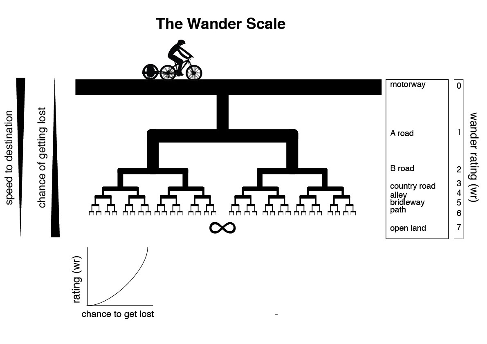
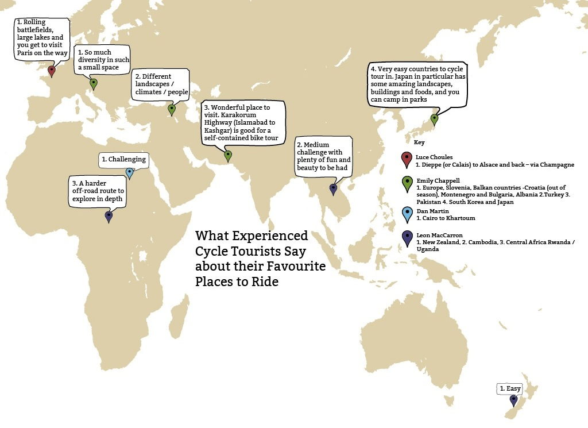
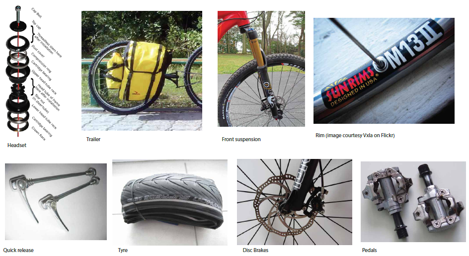
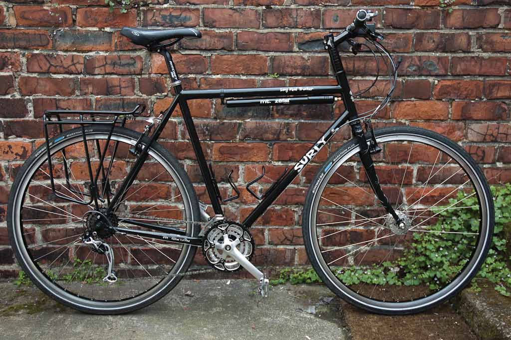
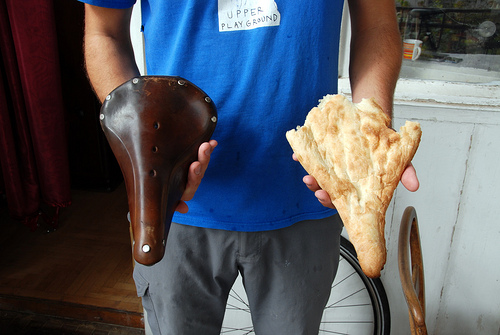

<!-- START doctoc generated TOC please keep comment here to allow auto update -->
<!-- DON'T EDIT THIS SECTION, INSTEAD RE-RUN doctoc TO UPDATE -->
**Table of Contents**  *generated with [DocToc](https://github.com/thlorenz/doctoc)*

- [Prepare, Pack, Pedal A Practical Guide to Bicycle Touring](#prepare-pack-pedal-a-practical-guide-to-bicycle-touring)
  - [Introduction](#introduction)
  - [CHAPTER TWO - Creating a plan](#chapter-two---creating-a-plan)
    - [Researching](#researching)
      - [Health tips](#health-tips)
      - [General Travel Information Sites](#general-travel-information-sites)
      - [Visa information](#visa-information)
      - [Border-crossings](#border-crossings)
      - [Routes](#routes)
      - [Cycle Touring Websites:](#cycle-touring-websites)
      - [Books:](#books)
    - [Mind maps for planning](#mind-maps-for-planning)
      - [Fleshing out an existing idea](#fleshing-out-an-existing-idea)
      - [Getting thoughts down](#getting-thoughts-down)
    - [Prioritising (The Covey Quadrant)](#prioritising-the-covey-quadrant)
      - [Quadrant I: Immediacy](#quadrant-i-immediacy)
      - [Quadrant II: Becoming](#quadrant-ii-becoming)
      - [Quadrant III: Temptation](#quadrant-iii-temptation)
      - [Quadrant IV: Time Wasting](#quadrant-iv-time-wasting)
    - [Minimal GTD](#minimal-gtd)
      - [Step 1: Capture](#step-1-capture)
      - [Step 2: Process](#step-2-process)
      - [Step 3: Plan](#step-3-plan)
      - [Step 4: Do](#step-4-do)
  - [CHAPTER THREE - Where should you go?](#chapter-three---where-should-you-go)
      - [Reality check](#reality-check)
    - [What Some Cyclists Say About Riding Destinations](#what-some-cyclists-say-about-riding-destinations)
    - [Riding alone vs. Riding in a group](#riding-alone-vs-riding-in-a-group)
  - [CHAPTER FOUR - Raising Money](#chapter-four---raising-money)
      - [Remember:](#remember)
    - [Funding and Sponsorship](#funding-and-sponsorship)
      - [Before you approach the sponsors](#before-you-approach-the-sponsors)
      - [How to approach sponsors](#how-to-approach-sponsors)
  - [CHAPTER FIVE - Equipment](#chapter-five---equipment)
    - [General equipment kit list](#general-equipment-kit-list)
      - [Clothing](#clothing)
      - [Additional luxury items](#additional-luxury-items)
      - [Camping equipment](#camping-equipment)
      - [Additional luxury items](#additional-luxury-items-1)
      - [Bike repair](#bike-repair)
      - [Additional luxury items](#additional-luxury-items-2)
      - [Bike (mountain bike specific)](#bike-mountain-bike-specific)
      - [Bike spares](#bike-spares)
    - [Food](#food)
      - [A typical meal](#a-typical-meal)
    - [Short bike tour](#short-bike-tour)
      - [Tools](#tools)
      - [Clothes](#clothes)
      - [Cooking / Food](#cooking--food)
      - [Documenting](#documenting)
      - [Navigating](#navigating)
      - [Sleeping](#sleeping)
  - [CHAPTER SIX - The Bike](#chapter-six---the-bike)
      - [Equipment Overview](#equipment-overview)
      - [Drivetrain](#drivetrain)
      - [Gear Changers (derailleur)](#gear-changers-derailleur)
      - [Cassette](#cassette)
      - [Chain](#chain)
      - [Bottom Bracket](#bottom-bracket)
    - [Suspension and frame](#suspension-and-frame)
      - [Sizing](#sizing)
      - [Bike Type](#bike-type)
      - [Remember:](#remember-1)
      - [Frame](#frame)
      - [Headset](#headset)
      - [Front Suspension](#front-suspension)
      - [Tip:](#tip)
    - [Wheels](#wheels)
    - [Rims](#rims)
    - [Spokes](#spokes)
    - [Quick Release](#quick-release)
    - [Tyres](#tyres)
    - [Brakes](#brakes)
    - [Magura Louise hydraulic disc brakes](#magura-louise-hydraulic-disc-brakes)
    - [Seatposts](#seatposts)
    - [Handlebars](#handlebars)
    - [Riser vs. Flat handlebars](#riser-vs-flat-handlebars)
    - [Pedals](#pedals)
    - [Luggage](#luggage)
    - [Trailers](#trailers)
    - [Drybags](#drybags)
    - [Panniers](#panniers)
    - [Modifications](#modifications)
    - [Adjusting your bike for comfort:](#adjusting-your-bike-for-comfort)
    - [Brooks](#brooks)
  - [CHAPTER SEVEN - On the Road](#chapter-seven---on-the-road)
    - [Accommodation](#accommodation)
    - [Hospitality networks](#hospitality-networks)
    - [Other resources](#other-resources)
    - [Health](#health)
    - [First aid recommendations:](#first-aid-recommendations)
      - [European Health Insurance](#european-health-insurance)
    - [Working](#working)
    - [Remember:](#remember-2)
    - [Entrepreneurialism](#entrepreneurialism)
    - [Manual work](#manual-work)
    - [Teaching](#teaching)
    - [Other resources](#other-resources-1)
  - [CHAPTER EIGHT - Maintenance](#chapter-eight---maintenance)
    - [Practical bike maintenance - tips & cheat sheet](#practical-bike-maintenance---tips-&-cheat-sheet)
    - [Wheels](#wheels-1)
      - [Truing the wheels](#truing-the-wheels)
      - [Spoke Nipples](#spoke-nipples)
    - [Tyres and Tubes](#tyres-and-tubes)
      - [Fix a puncture](#fix-a-puncture)
      - [Tip:](#tip-1)
    - [Hubs](#hubs)
    - [Headset](#headset-1)
    - [Removing grips](#removing-grips)
    - [Brakes](#brakes-1)
      - [V-brakes](#v-brakes)
      - [Cables](#cables)
      - [Disc Brakes](#disc-brakes)
      - [Frame Care](#frame-care)
    - [Drivetrain](#drivetrain-1)
      - [Bottom Bracket](#bottom-bracket-1)
      - [Fixing a chain](#fixing-a-chain)
    - [Finding replacements](#finding-replacements)
    - [Maintaining your bike on the road](#maintaining-your-bike-on-the-road)
    - [Pre-trip](#pre-trip)
    - [Tip:](#tip-2)
    - [Daily](#daily)
    - [Weekly](#weekly)
    - [Monthly](#monthly)
  - [CHAPTER NINE - Road Philosophy & Experience](#chapter-nine---road-philosophy-&-experience)
    - [Coping with boredom](#coping-with-boredom)
    - [Tip:](#tip-3)
    - [Engage with people](#engage-with-people)
    - [Go Slowly](#go-slowly)
    - [Hospitality and Accepting Invitations](#hospitality-and-accepting-invitations)
    - [Trust people](#trust-people)
    - [Know when to leave](#know-when-to-leave)
    - [When to keep going and when to stop](#when-to-keep-going-and-when-to-stop)
    - [The case for stopping](#the-case-for-stopping)
    - [The case for continuing](#the-case-for-continuing)
  - [CHAPTER TEN - Documenting](#chapter-ten---documenting)
    - [Digital tools whilst living as a Nomad](#digital-tools-whilst-living-as-a-nomad)
      - [Photography & Video](#photography-&-video)
      - [Audio](#audio)
      - [Open Source Software](#open-source-software)
    - [Travel Photography](#travel-photography)
      - [Equipment](#equipment)
      - [Digital vs. Analogue](#digital-vs-analogue)
      - [Storage](#storage)
    - [Tips for adventure filming](#tips-for-adventure-filming)
      - [Podcasts](#podcasts)
      - [Establishing shots are crucial](#establishing-shots-are-crucial)
      - [Engage with people](#engage-with-people-1)
      - [Framing is important](#framing-is-important)
      - [Capture signs](#capture-signs)
      - [Actuality or Action](#actuality-or-action)
    - [Travel filming reflections](#travel-filming-reflections)
  - [CHAPTER ELEVEN - Putting your bike on other transport](#chapter-eleven---putting-your-bike-on-other-transport)
    - [Trains](#trains)
      - [Seat 61](#seat-61)
    - [Buses in Europe](#buses-in-europe)
    - [Case Study: Going overland from England to Georgia by public Transport](#case-study-going-overland-from-england-to-georgia-by-public-transport)
    - [Case Study: Going overland from England to Mongolia (and back)](#case-study-going-overland-from-england-to-mongolia-and-back)
      - [Timing helps](#timing-helps)
    - [Final words](#final-words)
  - [CHAPTER TWELVE - Extending the experience](#chapter-twelve---extending-the-experience)
    - [Case study: North to South America off-road](#case-study-north-to-south-america-off-road)
    - [Merging maps](#merging-maps)
    - [Self-sufficiency](#self-sufficiency)
    - [Observations for the Mongolia cyclist](#observations-for-the-mongolia-cyclist)
    - [Bike Culture - is there such a thing as a cyclist philosophy?](#bike-culture---is-there-such-a-thing-as-a-cyclist-philosophy)
    - [Velocio](#velocio)
    - [Bike Snob](#bike-snob)
    - [Velominati](#velominati)
    - [Cycling - Philosophy for Everyone](#cycling---philosophy-for-everyone)
    - [Memoirs](#memoirs)
    - [Conclusion](#conclusion)
    - [Please also check out my other books](#please-also-check-out-my-other-books)

<!-- END doctoc generated TOC please keep comment here to allow auto update -->

# Prepare, Pack, Pedal A Practical Guide to Bicycle Touring

by Andrew Welch

## Introduction

In a world where we are increasingly cut off from our surroundings and environment, cycle touring offers a way to reconnect. There is a need and desire to simplify the standard tourist packaged adventure holidays and find alternative ways to explore and discover that genuinely open up the world to people. Adding a bit of risk into life can be the key to discovery and finding meaning. Cycle touring is an excellent catalyst for this.

Cycle touring is also cheap and accessible to all. It doesn’t require, contrary to popular opinion, a lot of equipment, technical expertise, money or fitness. Everything in this practical guide can be accomplished on a tiny budget, and with no experience. The only thing you will need is a willingness to discover, openness to the unknown, and an acceptance of people and cultures.

You don’t have to be strong, fit, male, or in any way athletic to go cycle touring. It’s just a means of transport. It’s also a brilliant way to travel because it’s cheap, gets you fit, and it puts you in contact with your environment and the people in the towns and countries you visit; borders are easier to cross; people are friendly because you turned up on a bike and treat you less like a tourist. Gradually, you get used to the travelling experience and feel less paranoia about riding in unknown territory or meeting nasty people along the way.

Cycle touring is not something that is on a bucket list of 1000 ways to travel. It’s completely unique - evolved even - and it has become very popular in its niche because it works. No other way of travelling will provide exactly the same kind of experience. You can go from A to B or you can go via the rest of the alphabet. It’s up to you, the amount of time you have, how much you want to get away from the ‘main road culture’, and how deep you want to go into the experience.

Ultimately, cycle touring is when you get a bike - doesn’t really matter which one - put some bags on it with your stuff in it, check you have some money and your passport, point your bike at the horizon, and start pedalling. It’s all about cutting loose - but in a Western world, where it is commonly thought that decisions have to be qualified and rationalised before they can be made, a little information can help you make the most difficult step: leaving.

After spending three years on the road, travelling by bicycle across 18 countries - from England, through Europe, Iran, Pakistan, Nepal, India, and Mongolia - I have picked up a wealth of knowledge. I have broken my knowledge into pre-trip planning, dealing with being on the road, and ways to enhance the experience whilst on the road. There are sections on equipment and kit, example case studies, anecdotes from my own experience, and recommendations that have been proven to work for many other cyclists.

I don’t pretend to have created the ‘go-to’ manual for cycle touring. Instead, this book encourages you to reflect upon why you want to travel and what you have set out to achieve. It points you towards the tools and resources that will help you realise that goal.

##CHAPTER ONE - Pre Trip

###Motivation, Organisation & Workflow

*When I decided on go travelling by bike, I had a full time job and very little time to think about anything other than that. I needed to make some space in my life. I found that after I had decided to go cycle touring I had a focus and something to look forward to. This inspired me to make unusual changes to my life. Instead of relaxing in the evening after a hard day at work, I would re-energise myself by eating good food, going out running, and engaging with planning and research. The monotony of life fell away and left me with a clear idea of what had to be done to work towards my newly established goal.*

Life after university is often confusing. After having tasted some independence, you begin to encounter the realities of work and self-financing. Even later in life, perhaps you find you’ve fallen into some work that you’ve become stuck in; you’ve become comfortable and apathetic and are finding it difficult to make a change. Following one’s passions is a shrewd (and much safer) route to take at this stage, even though it’s often the time when people are telling you to do the opposite.

If you already have a busy schedule but are planning to go on a trip at some point, you will need to be able to free up some time to organise the trip whilst continuing to live your everyday life. This may mean fitting in planning and research around a day job or social life. The first step is to organise yourself and structure your time so that you can fit everything in. There are many tools out there to help make it easier, whether a task-list smartphone app (check out Gtasks for iPhone that syncs with Gmail), or a good old fashioned notebook.

Going on a big bike trip will be quite the lifestyle change, so you may as well get used to living differently in the meantime to prepare yourself. When on the road, you have to be open to any eventuality, accept invitations, and be prepared to throw your usual routine out of the window. This may mean late nights and re-arranging how you use your time from leisure activities to do more productive things.

It is important to keep motivated and energised, but you should find that by changing your approach to your activities, you have a strong burst of initial momentum behind you. For example, instead of looking forward to sitting down and being inert, you will automatically get on with something purposeful - and this movement and momentum will filter into everything else in your life. Call it becoming more ‘conscious’, ‘aware’, or ‘pro-active’, it’s basically all the same thing. Interspersing periods of work with brisk walks, swimming, and other non’impact activities that refresh and revive is a winning combination.

It’s also recommended that you check your usual dietary routines, drinking habits, etc. and try to make sure that you think about how this will change on the road. Your resources are limited, so try to think about how you can maximise the amount of energy you have to put into your preparation - coffee is good for staying up and pouring over maps and books, but you can’t live off it and will only end up crashing if you try!

## CHAPTER TWO - Creating a plan

You’ll need two things to make your cycle touring dream into a reality:

1.  A solid idea
2.  Unwavering passion

If you have a concrete picture of what you want to achieve, you’ll be less likely to get sidetracked and shelf your ambition. If you have passion, you’ll find you have the momentum to carry it through.

Rather than getting bogged down in the idea of doing something and adding more layers of complexity, it’s important to set a date, get out there and do it.

Steps to get you on the road

1.  Pick the context of your trip: on-road, off-road, across continents, ethnographic research with a remote village tribe or exploring your local neighbourhood
2.  Identify the goal of your trip: a destination, a discovery, a distance, a feeling, making art, collecting stories
3.  Action: make the first steps towards getting your trip underway (they may be very small steps at first)
4.  Make a clear plan and set mini-goals to help craft your way towards the big goals. Think through each step
5.  Train and achieve the mini-goals in your plan which lead up to the big goal, i.e. leaving
6.  Go!

Making a change in your life to make something big happen can feel strange. Here are some things you may start to feel:

-   It feels like something new is happening
-   It feels like there is movement
-   It feels like there are requirements
-   Emotions occur without a familiar language or signification structure - this may stop them from having complete meaning or making complete sense
-   It requires thinking on my feet so I feel more alert
-   It makes me more conscious so I feel more aware
-   It motivates me act to outside of normal routines so I feel more open minded
-   It evokes fear so I feel apprehension
-   It evokes the imagination so I feel more inspired

### Researching 

I started a collaborative ‘Wiki’ website where I wrote down all sorts of stuff: from the philosophy of why I was going to kit lists, visa information for each country I planned to visit and medical advice.

There is so much information out there that it often seems overwhelming to the extent that its difficult to know where to start. However, if you have a good system that allows you to absorb information at a steady rate, collect what is useful and discard what isn’t without getting sidetracked (Minimal GDT is especially good for this), then the internet as a research tool can be extremely powerful. It not only allows you to find information but also to connect with the people and organisations behind the information.

#### Health tips

-   [Staying Healthy On A Bike Tour](http://travellingtwo.com/resources/healthybiking)
-   [Tour Tips & tricks: Health](http://www.tour.tk/cycle-touring-health-tips.htm)
-   [10 Ways to Stay Healthy on a Bike Tour](http://www.adventurecycling.org/resources/blog/10-ways-to-stay-healthy-on-a-bike-tour/)
-   [Boots Vaccination Advice](http://www.boots.com/en/Pharmacy-Health/Health-shop/Travel-health/Travel-vaccinations-and-advice/)
-   [NHS Scotland Travel Health Advice](http://www.fitfortravel.nhs.uk/home.aspx)

#### General Travel Information Sites

-   [Foreign office travel advice](https://www.gov.uk/foreign-travel-advice)
-   [Lonely Planet Thorn Tree Forum](http://www.lonelyplanet.com/thorntree/index.jspa)
-   [Travel Stack Exchange](http://travel.stackexchange.com)

#### Visa information

-   [A Comprehensive Guide to Visa Requirements the World Over](http://www.projectvisa.com/)

#### Border-crossings

-   [Land border crossings checklist](http://2backpackers.com/2839/travel-tips/land-border-crossing-checklist)
-   [Border crossings tips from many sources](http://www.horizonsunlimited.com/on-the-road/border-crossings)

#### Routes

-   [European Bike Routes 1](http://travellingtwo.com/13345)
-   [European Bike Routes 2](http://travellingtwo.com/resources/3-great-bike-paths)
-   [A network of high-quality cycling routes that connect the whole continent -](http://www.eurovelo.org/)
-   [An ad-hoc route through the Americas](http://www.ridingthespine.com/fundraiser/theroute1.html)
-   [A comprehensive resource of routes](http://www.adventurecycling.org/routes-and-maps/)
-   [The Great Divide Mountain Bike Route](http://www.adventurecycling.org/routes-and-maps/adventure-cycling-route-network/great-divide-mountain-bike-route/)

#### Cycle Touring Websites:

-   [A well designed informative site](http://travellingtwo.com)
-   [Long running and diverse site](http://www.bicycletouringpro.com/)
-   [Many articles and good photography](http://tomsbiketrip.com/)
-   [Multi-contributor site](http://www.biketouringtips.com/)
-   [Hundreds of stories of trips to get inspired](http://www.crazyguyonabike.com/)
-   [Great design and plenty of photos](http://goingslowly.com/)
-   [Accessible equipment advice](http://www.cycletourer.co.uk/)
-   [Specialist information](http://www.sheldonbrown.com/)
-   [An excellent resource of further links](http://cyclingabout.com/index.php/2012/01/our-favourite-bike-touring-links/)

#### Books:

-   Pedalling to Hawaii: A Human Powered Adventure Across the Western Hemisphere - Stevie Smith
-   SAS Survival Guide - John ‘Lofty’ Wiseman
-   Moods of Future Joys - Alastair Humphreys
-   Sponsorship Seeker’s Toolkit - Anne-Marie Grey and Kim Skildum-Reid
-   Off the Rails: Moscow to Beijing on Recumbent Bikes - Tim Cope and Chris Hatherly
-   Weave of the Ride - Andy Welch
-   The Hungry Cyclist Pedalling Americas In Search Of Perfect Meal - Tom Kevill Davies 

### Mind maps for planning 

Reading about cycle touring is one thing, getting out there and making it happen is another. Once you’ve carried out some basic research and have decided you want to go ahead with your great adventure, you’ll need to start organising your own thoughts to make it happen.

Mind-mapping, like brainstorming, is focused on the ‘associative’ way that the brain structures information. It is a fast way to get ideas down and to use lateral thinking to solve problems by jumping between ideas on the map - a great way of fleshing out ideas for your trip. There are two ways to approach a mind map for planning a bike tour. The first is to flesh out an existing idea. The second is to create a map of thoughts that are not yet concretised.

#### Fleshing out an existing idea

Write down the central topic and come up with a list of the first things that come into your head. Write these in the top right corner of the page. These are BOI (Basic Ordering Ideas). Put these in one column. In the other, ask yourself the 5 Ws and 1 H (Who, Why, Where, When, What, How) and make another list. Build your first branches of the mind map from the two lists and go from there. You might use a mind map for organising your ideas on how to get sponsorship, where to travel, or who to take with you.

#### Getting thoughts down

Write the BOIs (first branches), and extend each new, second-level branch based on those. It is important that the thoughts are spontaneous. You can record 5 or 10 items or however many you like. Continue doing this until you create a root or tree-like structure. Draw lots of pictures and use colours. This kind of mind map can be a good tool for understanding how you feel about something: your motivation for going on cycle tour, your preconceptions about the experience and things you feel you need to do before you leave.

There are apps out there for mind-mapping. You can often insert any media you like into the mind map and export them in various formats. I find this is a helpful addition to keeping a regular notebook.

### Prioritising (The Covey Quadrant) 

+--------------------------+--------------------------+--------------------------+
|                          | **Urgent**               | **Not Urgent**           |
+--------------------------+--------------------------+--------------------------+
| **Important**            | I                        | II                       |
+--------------------------+--------------------------+--------------------------+
| **Not Important**        | III                      | IV                       |
+--------------------------+--------------------------+--------------------------+

It’s easy to get bogged down in preparation for a bike tour. Ask yourself: does each of the tasks you’ve set yourself really need doing, and if so, when?

In the table above, the numerals (I-IV) signify quadrants. When setting priorities, decide which quadrant your activity belongs in. Then use the quadrant to prioritize the activity.

#### Quadrant I: Immediacy

Quadrant I contains the urgent and important: needs doing now. Depending on how close you are to leaving, this might include paying your everyday bills, sorting out your visas and getting a bike.

#### Quadrant II: Becoming

Quadrant II contains the important-but-not-urgent. It’s the quadrant of ‘becoming’, where most personal development activities happen. Quadrant II is where you get the highest leverage and biggest boost to your life. Pre-trip changes to your lifestyle belong in this category. Consider turning the TV off in the evening after work and doing some research about your trip. If you want to get in shape before you leave, use that time to go for a run.

#### Quadrant III: Temptation

Quadrant III is the quadrant of temptation. It’s a bit like Social Media. Use this quadrant to disambiguate the urgent from the important; it should contain activities that feel urgent, but do not directly help you achieve your goals. Do you really need to respond to that text message while you’re busy planning your trip?

#### Quadrant IV: Time Wasting

The final quadrant is the real time wasting quadrant. This is stuff that’s neither urgent nor important. Quadrant IV activities should be viewed with extreme suspicion. This might be needlessly maintaining your email account when it doesn’t require it or posting pointless updates on Facebook. Make a big list of your time wasting activities and cut ties with them; you’ll feel lighter for it.

### Minimal GTD 

Travel triggers lots of ideas. From the initial conception of the idea there is a process required to choose which idea is worth pursuing, which can be a difficult thing to do. It is a worthwhile practice though. We have a limited time on the planet (at least with present technology and cosmetics) and there is a certain amount of time needed to reflect upon and process our experiences.

If you have a ton of stuff to do before you leave and you’re having trouble organising your thoughts, try this minimal approach (adapted from Zen Habits).

#### Step 1: Capture

Get a notebook and carry it everywhere. Write down all your thoughts, ideas, to-do items and doodles. You might be making lists of places you want to visit or bike components you need to source. Or you might be writing down errands you need to run before you leave, like writing a resignation letter. Download a to-do list app like ‘Gtasks’ or ‘Walker’ and transfer the items into this list. Have a physical inbox in your workplace or home - and put incoming stuff in it.

#### Step 2: Process

Go through your to-do list and inbox and process the items quickly, making quick decisions. Do this at least once a day. If it takes less that two minutes to do the task or deal with the item, do it, otherwise either delegate it or give it a date and put it back on your to-do list. Give each item a status. Some labels I use are: ‘chores / recurring tasks’, ‘delegated’, ‘deferred’, ‘reference’, ‘in progress’, ‘someday / maybe’, and ‘2-mins’.

#### Step 3: Plan

Each week, set your big rocks - max 3 per week - the big things you want to achieve, like setting up a blog, getting your bike fitted or quitting your job. Then, each day, set a maximum of three MIT’s (most important tasks) and make sure you finish them by the end of the day. Do your MITs early in the day if possible and get them out of the way.

#### Step 4: Do

Focus on one task at a time, and eliminate distractions. While you’re in the ‘doing’ phase, write any incoming requests or distractions in your capture notebook as per step one rather than allowing them to sidetrack your actions. It will take a bit of getting used to; you might find yourself stopping and randomly writing stuff down in your notebook, but that’s good.

## CHAPTER THREE - Where should you go?

If you travel by bike, it can seem like the potential for where to go is endless. You can easily cross borders with your vehicle, you have no fuel costs and you are not constrained by timetables, delays, or traffic. You have a huge amount of freedom. This is one of the main reasons why people go by bike; you can stop when you like, start when you like, and you have the flood of endorphins from riding a bike all day. Because you are better connected to your surroundings and other people, it is far more likely that people will stop you for a chat - maybe even invite you into their homes if you are lucky!

However, a bike is a piece of technology and just like all other technologies it has its real possibilities and impossibilities, or affordances. A bike affords a particular kind of experience and offers a lot of constraint in this respect.

For example, a bike has a relatively low maximum speed, so you are limited when it comes to hurrying towards a destination. Equally, you can’t just put in more fuel in order to keep going; as the engine, you, the rider, will probably have to stop and take a rest! However, each of these limitations has a positive quality. When you have to stop because you are really tired it’s a great opportunity to spend an evening with a local family or enjoy a night sleeping under the stars in your tent or bivvi bag. One thing you may notice as you ride is that your experience of time completely changes because of these constraints and causes you to make different decisions about where and when you can travel. The question of ‘where to go’’ then becomes quite simple.

The above diagram demonstrates what I call ‘Wander Theory’. It is a fractal-like pattern applied to roads: from large roads to small tracks. If you stay on the large roads, you get there quickly and more assuredly but you see less and have less chance for serendipity and chance meetings to occur.

If you stray from the course and keep straying, you will likely end up somewhere completely different and not reach the goal you’d originally had in mind. This can be a good thing, depending on the amount of time you have, how much you want to get away from the ‘main road culture’, and how deep you want to go into the experience.

#### Reality check

Before you set off, it’s easy to get really over excited looking at places on the internet, in guidebooks, and on maps - which is, of course, great and should be encouraged. In reality, the likelihood is that you will start in one place, cycle for a while in a more or less winding line, literally stopping everywhere along the way when you are not pedalling slowly alone.

If you find you need a change of scenery then you can hop on a bus or train with your bike and fast forward ahead, but be aware that this can break your rhythm and you will find yourself having to start from scratch with the everyday flow of travelling.

There are many ways to approach a cycling trip. One would be to set a destination and then cycle there, but an alternative would be to go wherever your desire takes you and see where you end up.

### What Some Cyclists Say About Riding Destinations 

### Riding alone vs. Riding in a group 

There are benefits to be had from each. Riding alone is more about observing the world more keenly, coping with fears, and learning to think in a more creative way to make your own experience. Riding in a group is more about coping with relationships, learning to be humble and not letting your ego get in the way of the collective experience. Whichever you choose will depend on what you want to get out of the experience.

## CHAPTER FOUR - Raising Money 

How much money you will need to raise before your trip will depend on your current financial situation and where in the world you plan to travel. I lived very much on a shoe string. In European countries, I spent around 5 Euros per day. In India, 5 Euros can take you much further and I spent more like 2/3 Euros per day.

There are a number of options for how to raise money before you leave, from getting a full time job to starting your own business. It’s even better if you can take your work with you (for example, by setting up an online business before you leave and managing it remotely). See the chapter on ‘Working’ for more information.

#### Remember:

The money you’re able to raise before you leave needn’t straightforwardly limit how far you’re able to travel. I spent £3,500 pounds over the course of 7.5 months in Europe; I then earnt about £3,000 working in Tbilisi, which funded the next leg of the journey travelling in India and Nepal. After that, I returned to Georgia, worked, and earnt about £2,500. The next trip in Mongolia probably cost about £1,500 for 5 weeks, all inclusive of travel and a few extra pieces of equipment.

### Funding and Sponsorship 

When I looked for sponsorship for my bike tour, I first decided what equipment I wanted. It was quite a paradigm shift to go from thinking ’What can I afford to buy? to ’What is the ideal equipment, and who makes it? It was a completely different type of approach, and the end result was less certain, but the thought that I might actually end up with my ideal kit felt exciting. I made a list of the equipment I needed and then found suppliers that made them. Reading reviews online, I found out which companies made the best ones and then tried to find the people who dealt with sponsorship or marketing, getting their email addresses and phone numbers. I made a lot of phone calls - some fruitful, some not - and there were usually things that I would have to do in return for any equipment that was offered. In hindsight, it was a valuable process, but not the only way of doing things. An alternative could be to handcraft your bike frame in a workshop - an activity that would be satisfying for completely different reasons - or building your ideal touring bike from scrap parts.

On the one hand, sponsorship can seem like a good way to get free stuff. On the other, it can be a natural progression to involve more people in your project, enabling it to gain momentum and publicity.

Getting your kit from sponsors also has the affect of making the trip feel more real. However, involving third parties has pros and cons. Some sponsors will be more eager than others to follow your trip. Most will just be interested in receiving photos, stories and materials showing their equipment in action. Some sponsors may seem to want to take the whole thing over!

With sponsors that want you to help out with testing equipment, using their kit can be quite a rewarding process.

#### Before you approach the sponsors

Decide on your ideal equipment, which involves knowing what you are going to do and deciding what equipment you will need to make that happen.

I trawled internet forums and review sites for the best bike components. My previous mountain biking experience also gave me some inside information about which parts lasted the longest.

Anything that you cannot get from sponsors can be bought off eBay without the responsibility of having to give something back, but if you develop a positive working relationship with a sponsor then you can potentially ask them to support future journeys because you will have proven that you can provide beneficial exposure for them.

#### How to approach sponsors

Now you have decided on the kit you need, find the right person who deals with sponsorship at the company. Call them up or look on their website. It’s a good idea to send an email indicating your intentions and forewarning them that you are going to call. Alternatively, you can write a letter and mail it to them.

Telephoning is definitely the most effective way to get support because it is direct, personal and more difficult to ignore than emails.

A following through social media and a blog or website can provide back up for the potential sponsor to follow through after the phone call. If you can get a meeting then brilliant; otherwise, simply state your intentions, what you need, and what you can deliver in return. Repeat that and be persistent! (but at the same time, be polite and respectful).

Be realistic about what you can deliver in return for sponsored kit.

-   Have you got a website’ Are you a good photographer, writer, film-maker?
-   Can you create media in which the equipment will appear, allowing people to see it in action?
-   Can you weave the products into the narrative?
-   Is there a space for the equipment in your journey/

Resist the temptation to go mad and start adding non-essential items to the kit list. (Do you really need a heart-rate monitor’) Be realistic with the spares you will take.

Overall it is probably as much, if not more work to get sponsorship that to earn the cash yourself and buy the equipment - but it can give rise to beneficial publicity and other useful partnerships in the long term.

## CHAPTER FIVE - Equipment 

Good design, when it’s done well, becomes invisible. It’s only when it’s done poorly that we notice it. The idea is to design your bicycle touring equipment kit list that so you don’t even need to think about it while you’re on the road.

At the beginning, you will have to get used to being on the road and living out of your panniers, but you should soon acclimatise. Eventually you will get a good system going that allows you to concentrate on the experiences of travelling by bike without your equipment being a distraction or frustration.

The kinds of questions to consider when preparing your equipment include:

-   How long and how far?
-   Over what kind of terrain? (Mountain bike, road bike or trekking bike)
-   What kind of weather will you be expecting? (Light summer clothes or full winter warmers)
-   Are you camping or staying at hotels and hostels? (Camping gear, credit card or both)
-   Where are you starting from? (Set up at home or at your starting point)
-   Are going to stay in civilisation or will you go somewhere into the wild where you are some hours or days away from medical help or a bike store?

Prepare to fix everything yourself. In other words, take all the necessary tools and spares.

### General equipment kit list 

I would recommend tailoring your personal kit list to the type of touring you will be doing. Choosing the right equipment was a considered process for me - having the right clothing, bike equipment, camping and survival equipment for life on the road makes a huge difference.

I have compiled a recommended kit list based on my own equipment. Adapt it for your specific case.

#### Clothing

-   Lycra shorts
-   Long sleeved breathable base layer
-   Short sleeved breathable base layer
-   Sports-style shorts (for casual and over-the-top-of-Lycra wearing)
-   Pair of sturdy boots (you can go for the Shimano Trans-Alp boot or perhaps a comfortable walking boot) - choose whatever is comfortable; you will be living in them
-   Couple of pairs of cotton socks
-   A breathable fleece jumper / jacket
-   A breathable waterproof jacket
-   Waterproof trousers
-   1 pair of underwear - whatever is most comfortable, although a thong might be more practical for washing
-   1 smart cotton shirt - perfect for cocktail parties and champagne receptions
-   1 pair of lightweight cotton trousers for loafing
-   Gloves - fingerless for the summer (you can get good ones from Decathlon); full finger for the winter
-   Oakley sunglasses or equivalent high quality pair - sunglasses are an essential piece of kit and it’s worth investing in a decent pair
-   Helmet
-   At least 1 warm headwear item (such as a Buff)
-   Maps, money (stashed several different places)

#### Additional luxury items

-   Waterproof socks

#### Camping equipment

-   MSR Dragonfly stove (or Trangia multi-fuel) - will burn petrol, diesel, alcohol, meths, paraffin, etc.
-   Vaude Hogan Ultralight tent (weighing in at 1.4kg) or equivalent - check out Sierra Designs, Marmot, Hilleberg, MSR
-   Mountain Equipment sleeping bag (I’ve got the -25’ comfort one)
-   Roll mat (Exped and Thermarest are good)
-   Silk sleeping bag liner (you can get this from eBay)
-   Multi-tool (Gerber or Leatherman)
-   First aid kit
-   Army pan set (from eBay)

#### Additional luxury items

-   Hunting knife (e.g. British army knife)
-   Spork / cutlery
-   MSR Miniworks water filter
-   Army issue poncho (check the British one on eBay)
-   Army bivvi bag (check the British one on eBay)

#### Bike repair

-   Alien Multi-tool (Allen keys, chain breaker, spanners, spoke wrench)
-   Puncture repair kit & Spare tube
-   Cassette tool
-   Zips ties
-   Duct tape
-   Pump (Mini master blaster mini track pump is a good choice)

#### Additional luxury items

-   Mini adjustable spanner
-   Bottom bracket tool
-   Crank extractor tool
-   Cone spanners

#### Bike 

The best guide to touring bikes online at present is on the [Cycling About website](http://cyclingabout.com/a-complete-list-of-touring-bicycle-manufacturers-with-prices/).

My old touring set up (between 2007 and 2013)

-   Kona Explosif (or equivalent steel frame)
-   Sun Rhyno Lite Rims on Shimano XT hubs with DT Swiss butted stainless spokes (or equivalent strong rims)
-   Schwalbe Marathon XR 2.25 tyres
-   Magura Odur forks (or equivalent short travel lightweight coil forks)
-   Adjustable stem
-   Yeti lock on grips (or equivalent comfortable grips)
-   Cheap bar ends
-   Shimano 8-speed gear shifters
-   Shimano XT front mechanism
-   Shimano XTR rear mechanism
-   Fibrax, Clarks, or Shimano XT gear cable inner and outer
-   Magura Louise brakes, levers and discs
-   FSA X-Drive cranks (or equivalent)
-   Wellgo V12 flat-pedals (or equivalent)
-   SRAM 8-speed chain
-   Shimano XT 8-speed cassette
-   Bontrager seatpost (although Easton or Thomson are often preferred)
-   Brooks Champion Flyer Saddle
-   Tubus Logo rear pannier rack
-   Carradice Super-C Panniers
-   Extrawheel Voyager single-wheel trailer with Crosso panniers
-   Chris King NoThreadSet

#### Bike spares

-   2 8-speed chains
-   Spokes
-   Spare bolts (including rack bolts)

### Food

How much food you take with you will largely depend on the area you’re travelling in. Travelling across less populated areas such as Mongolia will mean more food to carry and less opportunity to stock up while on the road. Obviously your diet will change while on the road. High carb, slow energy release foods such as noodles, pasta, nuts, etc. are a staple.

#### A typical meal

It is possible to live on relatively meagre food rations while on the road. However, cycling is hungry work so, on average, your consumption will probably go up. I ate bread, tomatoes and cheese throughout the day and then cooked lentils on a stove in the evening and ate that with bread. I also had some snacks of dried fruit, nuts or chocolate biscuits. I sometimes wish I had spent more time enjoying the local foods. However, restaurants are often over-priced and not as authentic as the food you’ll find in people’s homes. You’ll get to sample this if you’re invited in.

### Short bike tour 

When I cycled to Ireland I didn’t need a full set of equipment, so I reduced it down to the following list. In hindsight, the amount of kit I took was still too much, and it’s usually better to throw it out rather than take it with you - this runs counter to the ‘better safe than sorry’ attitude, where you lug it all along regardless.

#### Tools

-   Cone spanners
-   Small adjustable spanner
-   Allen keys
-   Chain tool
-   Puncture repair kit
-   Lock
-   Multitool
-   Pump

#### Clothes

-   Smart shirt / trousers
-   Hiking trousers (zip off)
-   Breathable long sleeved t-shirt
-   3 pairs socks / pants
-   Gloves
-   Fleece
-   Buff
-   Waterproof jacket

#### Cooking / Food

-   Cooking stove
-   Water bottle
-   Cooking pot
-   Fork
-   Camelback bladder
-   Noodles / pasta
-   Sauce
-   Dried fruit / nuts
-   Film camera
-   Google map print out
-   Bike path research

#### Documenting

-   Film Camera

#### Navigating

-   Google map print out
-   Bike path research

#### Sleeping

-   Tent
-   Sleeping bag
-   Headtorch
-   Roll mat

I still took 4 panniers for this short tour and there was plenty of space for food and water. It was a road tour, so a road- or road-touring-specific-bike would be ideal for this sort of trip.

## CHAPTER SIX - The Bike 

I come from a mountain biking background, which is why the kit I decided to take leaned towards mountain biking rather than skinny-tyred road touring. Unfortunately, most of the parts didn’t start arriving until a couple of weeks before we were due to set off - the wheels came two days before - which meant I didn’t have the opportunity to test the bike out before I set off.

After a month of cycling, when I couldn’t get used to the bike, I realised it didn’t fit properly. The frame was too small, which is fine for mountain biking, but for long days in the saddle it is much more comfortable to have a bigger frame. I spent hours tweaking the set up to make it more comfortable, which wasted a lot of time.

For these reasons, getting the right kit is important, but it is not the be-all and end-all of a trip. If you don’t have the money to get yourself kitted out properly, don’t let that stop you. Whilst on the road, we met two English girls travelling together on bikes they had found in a Hungarian scrap heap. One of them travelled about 2000km from Hungary to Istanbul. It was a 1950s recreational bike but everything worked fine after some maintenance. The brakes weren’t as good, the tyres weren’t as grippy, the saddle wasn’t as comfortable and the fit wasn’t perfect, but it worked - and it allowed her to see the world in a way she wouldn’t otherwise have been able to.

#### Equipment Overview 

#### Drivetrain 

My first mountain bike was a Rock Lobster which I bought second hand from a bike shop in York. Bizarrely it came with a Shimano 105 road rear mechanism, which soon bent on rocks and no longer indexed the gears properly.

Bicycle drivetrain systems are used to transmit power on bicycles, tricycles, quadracycles, unicycles, or other human-powered vehicles from the riders to the wheels. If you are choosing components, or checking out a bike for touring, you need to have a good drivetrain - it is what propels the bike! It needs a daily wipe over with a rag to remove grit and grime and keep it running smoothly.

I have used XTR rear mechanisms for my tours and I swear by them. I have only had to replace the jockey wheels, which are cheap and widely available. Even non-Shimano ones can be salvaged off any ‘spam’ bike on the road. XTR shifting is very accurate and they rarely need adjustment. Front mechanisms are less crucial so you can get away with a cheaper one like XT or Deore.

At first I used a titanium XTR rear cassette which lasted for ages with no wear. Its Achilles’ heel was the way the sprockets were joined together, which meant they failed and loosened. Currently I am running an 8 speed, bottom of the range Shimano cassette, which is a bit heavier.

#### Gear Changers (derailleur)

Shimano components are widely available and reliable. The mountain bike component range of Deore, XT, and XTR are built to withstand abuse, whereas road components compromise strength to reduce weight.

Be careful not to lean the bike down with the derailleur resting on something (kerb, rock, log, small animal) with the full weight of the luggage on it, otherwise it won’t stay straight for long!

#### Cassette

A bonus of the XTR (and generally higher end cassettes) is that they are lighter. The cassette cogs are rings rather than closed discs which allows for them to be cleaned a lot easier (e.g. with a toothbrush). ‘8 speed’ means that the cassette has 8 sprockets on it - the chain is slightly wider and therefore stronger. It is important that you also match this with 8 speed shifters, although it’s okay to use a 9 speed rear mechanism.

#### Chain

On a tour you will most likely change individual components when they inevitably wear out. I took a couple of spare 8 speed SRAM chains (which have the quick release chain link) and then swapped them every couple of thousand kilometres.

Clean the chain with a rag and apply oil; you can tell if it needs oil if it makes more noise than usual and the chain looks dry. If you are experiencing chain-skip then it may be that your chain, cassette, or crankset chainrings are worn. Ideally you would replace all three. Matching a new chain with an old cassette or chainrings will wear the chain quicker and vice versa.

#### Bottom Bracket

The bottom bracket is the component which the cranks fit onto, screwed into the ‘BB shell’ on the frame. Bottom brackets are usually pretty maintenance free if you buy one from a reputable brand such as Shimano.

Go for an ISIS splined attachment or a square axle (make sure you keep the crank bolts tight). A Truvativ bottom bracket is a reliable unit.

I used an SKF bottom bracket for my touring and it lasted for about 10,000km before the shaft snapped off. This, I was assured, was due to a faulty batch and I was provided with a replacement under the 10 year warranty. SKF are a company who are well known for making high quality bearings in the engineering industry and so they are well placed to bring that expertise into the cycling market.

**Crankset**

In terms of crankset, Race Face, Shimano or FSA will serve you well. It is rare that a set of cranks would fail and if they do it’s probably because there is a fault in the material. It’s worth contacting the manufacturer to ask for a replacement.

### Suspension and frame 

I’ve ridden a mountain bike for most of my touring because I wanted something which would be able to take plenty of abuse over a multiple year bike trip and cope with being heavily loaded with luggage. But choosing your bike frame is a delicate process.

#### Sizing

It’s all about choosing a bike that will provide a good cycling experience. A poorly sized frame can cause health problems and can make cycling an unpleasant experience.

There’s no universal standard for bike sizing due to the variety of designs and geometry. Size varies between manufacturers and intended use: touring, racing, and commuting bikes are all slightly different. Developing a relationship with your local bike shop is a good opportunity to try out different sizes and frames and get measured up for the right one.

For touring, it is generally a good rule of thumb - if you usually fit two different frame sizes - to go for the upper size; touring bike frames are usually quite big in comparison to road bikes and particularly modern mountain bikes. A proper fitting will take into account your geometry and the bike’s geometry and try to get a match. It may involve swapping stems, adding headset spacers or adjusting saddle setback. These adjustments make the frame feel bigger or smaller to get you comfortable.

The old traditional scheme for sizing a road frame was ‘standover height’. You’d stand with your feet flat on the ground, straddling the bike. If you had ‘comfortable’ (for a male) clearance of the (traditionally-positioned) top tube then the bike was the right size. ’This is by no means a steadfast rule but it is a good starting point.

The following links give references to further information on bike sizing:

-   [Freespeed](http://www.freespeed.co.uk/)
-   <http://www.londoncyclist.co.uk/bike-fitting-in-london/>

#### Bike Type 

There is a lot of speculation about the best kit to use, which is one of the fun parts of going. Cycle touring is one of the things that you can still do without the kit, but sometimes it’s better to benefit from others’ experiences and invest in stuff that has been well road tested.

Mountain bikes have different geometry to touring bikes. They are designed to climb or descend steep and technical tracks. Maneuverability, stability and vibration-absorbtion are high on the priority list. While a road bike pings along the tarmac effortlessly carrying its speed, a mountain bike will churn over minor ‘trail buzz’ gravel and will carry speed over uneven terrain. On uneven terrain, a road bike would be very uncomfortable - unless it was perhaps a ‘cyclecross’ bike (you can check this out if you want an interesting angle for touring bike selection).

#### Remember:

Fit your bike to your style of tour. If you are sticking purely to the tarmac you can use road tyres and not worry too much about the wheels. If you are going to be riding on poor quality roads then you want something that has been designed to cope with some bumps. You can go for a more rugged tyre too.

#### Frame

Some older frames had more laid back geometry, which means that they encouraged the rider to push higher gears and put more force on the knee joint. A further forward seated position means you will be more inclined to spin the cranks using lower gears.

Frames worth considering:

#####Touring specific
- [Soma Saga](http://www.somafab.com/bikes-frames/frames)

If it’s not road, consider something from the Dawes, Surly or Claud Butler touring range. The Thorn Nomad touring-specific bike is a beautiful piece of engineering.

#####Mountain bike
Updated 29.4.16
- [Ritchey Ascent](http://ritcheylogic.com/frames/mountain)
- Orange P7
- On One Inbred / 456
- Kona Explosif
- Genesis altitude
- Handsome Dog Talisman (cheap)
- Orange R8. 

Some others with no rack eyelets:

Without rack eyelets you can either use a converter which clamps to the frame or use a trailer.
- [Independent Fabrications Steel Deluxe](http://ifbikes.com/Bikes/steel-deluxe/)
- Pipedream Sirius (Reynolds 853) [Link](http://www.pipedreamcycles.co.uk/shop/sirius-r853/)
- Charge Duster
- Cotic Soul, which would be fine with a trailer.

In conclusion, for a long distance tour in a place where the roads disappear (like Mongolia) a mountain bike frame is a good choice. Otherwise, a steel touring-specific frame will be fine.

It’s worth looking at folding bikes like the Brompton, or bikes from Dahon, if you are planning to be hopping on and off public transport, but equally it’s perfectly feasible to pack up a bike into a box - I even managed it with a trailer too (see Chapter 11: Taking Your Bike on a Bus or Train).

Rack mount eyelets (for fitting a pannier rack) and bottle cage mounts (for water bottles) are design points of note. Racks mount eyelets are not essential because you can use an adapter with the ‘Tubus logo’ rear rack. However, you still need to have a place at the dropout to bolt the rack on to.

#### Headset

The headset is the component that allows for the forks to turn smoothly and fits into the steerer tube at the front of the bike. The Chris King headset, at over ‘100, is not cheap - but with a 10 year guarantee you might consider it worth the investment. There are alternatives, but the Chris King is renowned for its ’fit and forget’ reliability.

#### Front Suspension

There is a lot of hype around suspension forks. They are the things that people always bounce up and down whenever you stop somewhere and people fiddle with your bike.

For touring, it’s pretty straightforward. A pair of mid-range forks, with 80-100mm travel (around the ’250 mark) will serve pretty well. I used Magura Odur forks, which worked for me, but they’ve since been discontinued by the company.

Alternative forks: Marzocchi Corsa, RLO or Marathon, or the Fox Vanilla or [Float](http://www.foxracingshox.com/bike/11/forks) .

#### Tip:

Avoid forks which are specced for dirt jumping - although they might have the right travel, they will be heavier and designed for absorbing large impacts rather than giving a comfortable ride over the smaller stuff.

### Wheels 

Wheel choice for expedition biking is a personal one. I swear by the Sunn Rhyno Lite rims because they held up a long time and are still going strong. My wheels were built by a professional wheel builder at Leisure Lakes Bikes.

#### Rims

Choose a good set of rims. Rigida Sputnik 26″ and Sunn Rhyno Lite have a good reputation. The Sunn rims are double walled, welded and machined. Mavic rims tend to be avoided for touring use: they’re forged - which is lighter, but weaker. You can go for a lighter weight rim if you are planning on sticking to the roads.

Mavic rims were less obliging.

You will need to check the rim for any knocks which may have caused a sharp splinter to threaten to cause a puncture. XT disc hubs, which perform excellently, are easy to take apart, clean and re-grease (you will need cone spanners). The bearing races are still running smoothly.

The Sun Rhyno Lite rims are very strong. I’ve only had to true them a couple of times. They were built by Leisure Lakes Bikes and they are square and chunky. The rims have a v-braking surface if something was to go wrong with the disk brakes. I’ve also used them for off-roading in the Caucasus mountains. It would take something extraordinary to find something to better the design. They’re not the lightest, but they are incredibly durable with the 36 spoke build. A firm recommendation.

#### Spokes

Ask your wheel builder for 36 spoke rims, which will offer more strength. In terms of size, a 26 inch rim is easier to find replacements for, compared to 700cc rims which you often find on ‘off the peg’ touring bikes.

The increased diameter does offer an efficiency increase and you can still get spares as long as you aren’t venturing out of the developed world. My wheels rims are built with DT Swiss spokes. Hand built wheels are better than factory built wheels, which will require much more spoke tweaking during the first months of use.

Spray a small amount of WD40 on the inner side of the rim onto the spoke nipples, as well as on the outside of the rim. This will help to stop them from seizing up and breaking when you try to turn them. Gaffer tape will work okay as a replacement for rim tape.

#### Quick Release

Invest in decent quality quick releases. They’re an important component, seeing as they keep the wheel in place.

#### Tyres

The Schwalbe Marathon XR, used by most other adventure cyclists, was the obvious choice for a long distance tour. No punctures for 7000km. Debris from a burnt out tyre in Iran and thorns on Indian roads did manage cause some punctures, but not many. They are a ‘fit and forget’ solution, with excellent grip on road and dirt tracks. The rolling resistance is slightly more than you would get with a slicker and thinner option.

#### Brakes

Disk brake pads last longer than v-brake ones, especially with a great deal of weight on the bike. V-brake pads are also more fiddly to install. However, if the hydraulic brakes did fail then you’d have no brakes, which won’t happen with v-brakes.

If you are going on a light weight road tour using a racing style frame it’s unlikely the bike will have mounts for disc brakes. Whichever brakes you use are a personal choice. V-brakes wear very quickly in gritty, muddy and wet conditions.

### Magura Louise hydraulic disc brakes

I used Magura Louise hydraulic disc brakes. They require little servicing and are very powerful. The Magura Louise disk brakes perform very well. I was dubious about taking hydraulic brakes on a cycle tour, because I was worried that if something went wrong it would be very difficult to find spares; I would need to take spare oil and the service kit with me, which would be a lot of extra bulk.

However, I took the chance. Our sponsor showed unfailing confidence in the brakes. Rightly so, as they didn’t need to be serviced during the journey - only the pads needed replacing a few times.

The performance is exceptional: I could stop the bike with confidence, loaded with 30kg of luggage, in all conditions wet and dry. You can imagine the performance with an unloaded bike.

The rotors look good. We had pink ones to begin with - very stylish. The hoses are durable. The levers are made of aluminium (other than the bite adjustment knob, which is nylon, and the only weak point - worn from curious people fiddling and general wear and tear). The levers are well-sized and feel comfortable. The oil reservoirs are encased in forged aluminium with the name ‘Magura Louise’ imprinted. The only negative, I would say, is that some air has got into one of the hoses and caused the bite to feel spongy. This has only happened in recent use and, with a service due, it’s understandable.

### Seatposts

In terms of seatpost, many recommend Thomson, but their smooth finish means that they tend to slip. Bontrager seatposts come recommended, as do Eastern, and I used a Kona branded seatpost without any problems.

### Handlebars

Handlebar choice is a very personal thing. Butterfly handlebars are a popular choice for touring bikes.

### Riser vs. Flat handlebars

At first, I used DMR chromoly riser handlebars, which were a massive overcompensation for strength. They weighed a lot and I found they had a sweep back which was uncomfortable on the palms of my hands after long periods of riding. I swapped to flat bars and they were more comfortable.

Bar ends on standard flat bars offer more hand positions. Comfort-style grips and special rubber bar end plugs can add comfort. Adjustable touring stems can be bought from Decathlon and they allow for adjustment and comfort.

### Pedals

I started out using Shimano DX SPD mountain bike pedals, which were brilliant until I messed up the alignment of the cleats on my shoes after taking the cleats off and using the shoes to hike in South India (which dented the plastic cleat mount on the sole).

I spent many frustrating minutes by the roadside trying to get them aligned properly again and finally gave up having tweaked my right knee. I reverted to the Wellgo v12-copy platform pedals which I’ve used up until recently. Having allowed my knee to recover properly, I’ve been using SPDs again.

### Luggage 

#### Trailers

A trailer takes weight off the frame, making the bike more manoeuvrable. As of writing, there are two industry-standard trailers to use: the Extrawheel Voyager trailer and the BOB Yak trailer. The Extrawheel has an extremely simple design with the panniers attaching onto a lightweight frame. It is good on rougher terrain (the best option for mountain biking) and the spring metal fork attachment is more reliable than the attachment on the BOB Yak trailer, which uses lynch-pins that are attached by pieces of rubber and easy to lose.

The Yak is extremely strong and sturdy with a steel frame and platform. It’s better for carrying larger objects (for example, carrying wood) and works well on light off-road use. The small wheel does not tackle the rockier stuff as well as the Extrawheel, with its 26 inch wheel, but the carrying space offered by the Yak with its huge bag is fantastic. It is generally more convenient to have all kit in the one bag and then separated into drybags, but it can be easy to forget which pannier you put stuff in.

#### Drybags 

I strapped a 60 litre Extrawheel drybag on top of the rear pannier rack for holding the tripod, tent poles, roll mat or other long objects in. It protected them from dust and moisture. I strapped it on with a bungee and could then quickly attach other items by wedging them underneath the bungee (like a jacket, for quick access).

A large drybag is something that could likely be dropped to save weight. On the Mongolia trip, I took a Decathlon roll-top, drybag-rucksack combo bag. I could then use this to carry the luggage on public transport.

#### Panniers

The Carradice Super C panniers are well-regarded, long lasting and reliable. The pannier material is similar to an army kit bag: highly durable and quick drying. The attachment mechanism is durable and simple but over time this has worn and one of the clips has broken. The clips can be easily replaced.

A downfall of the design is side pockets with a clip buckle not secure enough to prevent things from falling out. This is not too much of a problem as long as you remember not to put valuable or small things in there. They are fine for holding bulky items like toilet rolls, clothes or snacks.

*I usually carried food in one of the rear panniers and clothes in the other, and then sleeping kit in one trailer pannier and the stove and other utility items in the other.*

Front panniers are an option but less necessary with a trailer. They more significantly affect bike handling and can sometimes be difficult to find on different types of forks. Ortlieb have an excellent bar bag that is incredibly useful for having quick access to camera, map or wallet.

### Modifications 

My touring setup was as follows:

-   Steel frame (Kona Explosif)
-   26 inch wheels (Sun Rhyno Lite)
-   disc brakes (Magura Louise)
-   Chris King Headset
-   XT disc hubs
-   FSA X-Drive cross country cranks
-   XTR rear mech
-   SRAM 8 speed chain
-   Shimano 8 speed XT shifters
-   Extrawheel trailer
-   Carradice panniers
-   Tubus logo pannier rack
-   Schwalbe Marathon XR tyres

Components to alter:

-   Butterfly handlebars
-   Bottom bracket: alternative to SKF (such as Phil Wood & Co)
-   Thinner wheels (and tyres)
-   Try out different brands of clip-in pedals like egg beaters, or ‘Time’ pedals instead of the Shimano SPDs

In most cases, getting the right bike build and fit is a case of making an initial best guess and then adjusting by trial and error as you go along. However, in the long term there may be some modifications to components that you want to make.

If you are intending to change some components, particularly to improve comfort, then check the following things:

-   Focus on your points of contact and your positioning on the bike
-   Are you totally happy with your saddle’
-   Are your shoes in good shape’ Are there points of discomfort or ‘hotspots’ after long days on the bike?

### Adjusting your bike for comfort:

Making adjustments to the position of things is important in improving comfort. Check stem length/rise, saddle height + fore/aft. Don’t change any of these things immediately before you go on a tour! You need a few long days in the saddle to test them out first.

#### Brooks 

The famous Brooks saddle has been the stalwart choice for cycle tourists since the days of yore. When I got one back in June 2007, I was not so convinced. The smooth but solid piece of leather stretched over the iron frame looked less than comfortable. It had no give, other than from the stiff iron springs it was suspended upon. I would have to endure 3 months of torture for the breaking-in process.

My experience with the saddle has had its ups and downs. At first, I had a frame size too small, so I was continually adjusting the saddle back and forth to try and find a comfortable configuration. At some point, the component allowing the leather saddle to sit on the saddle’s frame-structure bent outwards causing it to annoyingly disengage, making one side lower than the other. I fixed it by bending it back into shape with a pair of pliers.

Once the leather had softened, it was the most comfortable saddle available; the only saddle you can ride all day and still be comfortable. Over time, the saddle has misshapen and one side is more indented than the other. Here’s what bike guru Sheldon Brown says of the phenomenon:

‘A leather saddle, like a good pair of shoes or a baseball glove, softens with use, and molds itself to fit a particular person’s shape. What ever part of your rear end pushes hardest on the saddle causes the corresponding part of the saddle to soften and stretch to relieve the uneven pressure, until the saddle accomodates perfectly to your own particular tush’.

Cue jokes about the shape of my backside. I tried to rectify this by wrapping material around the saddle to push up the centre area. Tightening the leather tensioning bolt did temporarily improve the shape, until the leather stretched again. In hindsight, I would recommend closely following the Brooks saddle care guidelines. In addition, follow this advice from Sheldon Brown:

‘Most leather saddles have a tension-adjusting nut located under the nose of the saddle. Fortunately, this nut usually requires a special wrench, so most people leave it alone. In almost every case that I know of where someone has tried to adjust the tension with this nut, the saddle has been ruined. My advice is to leave it alone’.

However, Sheldon also recommend the following for solving the problem of misshaping:

‘If a leather saddle gradually becomes too soft and too wide after many thousands of miles, it is sometimes useful to punch a few holes in the bottoms of the side flaps and lace them together under the saddle frame. This allows the width and firmness of the saddle to be adjusted to the rider’s taste. Some older models came with a row of holes along the lower edge of the side flaps, for this very purpose’.

There is no more important contact point (for comfort and endurance) than the saddle.

Some useful links:

-   <http://www.sheldonbrown.com/leather.html>
-   <http://www.esande.net/features/newbrooks.html>

## CHAPTER SEVEN - On the Road 

### Accommodation 

Before I went travelling by bike, I wondered where I would stay. I took a tent with me and planned to camp wherever I could find a pitch, but I didn’t really know what would happen. I knew about the Couchsurfing service and had signed up for it, but I hadn’t used it before and had no idea whether it would work or not. Once on the road, finding a place to stay was at first quite nerve-wracking, but after a while I got used to it. I realised that something or someone would always turn up - I would find hospitality ’or at least a place to pitch my tent - whether with an Iranian family in Isfahan, students in Istanbul, at a temple in India, or on a fishing boat on the Black Sea Coastline in Turkey.

With bike and tent in tow, call upon a house, explain that you’re travelling by bicycle and ask if you can put your tent in their garden. It’s possible that they’ll invite you to sleep over at their house, propose a dinner and/or offer use of their shower. Don’t take others’ hospitality for granted, but don’t be afraid to enquire either.

The alternative would be to stay in hostels, B&Bs or hotels. It’s much more comfortable, but also more expensive and requires some planning - at least if you’re going through sparsely populated areas. Some countries (especially in Europe) have designated long-distance bike trails, and along them you’ll typically find so many places to stay that you can be quite spontaneous about where exactly you stop for the night.

### Hospitality networks

The concept of hospitality exchange refers to centrally organized [social](http://en.wikipedia.org/wiki/Social_network) networks of individuals - generally travellers - who offer or seek accommodation without monetary exchange. These services generally connect users via the internet.

-   [Warmshowers.org](http://warmshowers.org/) (dedicated to Cyclists)
-   [Couchsurfing.org](http://couchsurfing.org/)
-   [Bewelcome.org](http://bewelcome.org/)
-   [Hospitalityclub.org](http://hospitalityclub.org/)
-   [Globalfreeloaders.com](http://globalfreeloaders.com/)

### Other resources

-   [Pannier.cc](http://www.pannier.cc/) is a mapping-based resource for cyclists to find places to stay and rest along major routes

In the Netherlands there is a foundation called ‘vrienden op de fiets’ (friends on the bicycle), which annually publishes a list of accommodation addresses specifically catering to cyclists. Although it is centred in the Netherlands, their network does cover other countries as well. With these kinds of informal networks, you can cover quite some miles and not be alone while doing so. Also, the people you meet in these types of accommodation are often quite knowledgeable on local bicycle information and might be able to tell you some useful things. For example, they may have information about specific chartered bicycle bus services (they do exist in Europe).

### Health 

When I first went touring I looked at official medical reports from different countries and saw a whole range of diseases that I would likely contract without the relevant injections. When I went to get my injections at the doctor and they heard I was planning to cycle round the world, they gave me a supermarket bag full of first aid paraphernalia. I didn’t take all of it, but I was the butt of a number of jokes about the huge first aid kit that I did take. Unsurprisingly, I ditched most of the stuff after a short time. However, there were some essentials that I was very glad I took with me and would definitely recommend for any first time cycle tourer.

### First aid recommendations:

-   Painkillers
-   Fluid replacement
-   Sterile swabs
-   Cold medicines
-   Anti-histamines
-   Diarrhoea medicine
-   Sunblock
-   Micropore tape
-   Water purification tabs
-   Gauze pads, tape, and antibiotic ointment for ‘road rash’
-   A few assorted adhesive bandages
-   Hydrocortisone ointment, for insect bites and ‘butt burn’
-   Insect repellent
-   Ear plugs
-   Hydrocortisone
-   Decongestants

If you get seriously ill, there are always people around to help you - usually everyone is trustworthy. If you can, take rest with Couchsurfers or other people along the way.

#### European Health Insurance

In Europe, you can carry a European health insurance card which gives free cover in European hospitials. It is also recommended to take out an ‘adventure’ graded insurance policy. Companies that provide this include BMC and World Nomads (check in the policy what is covered). Generally, when you are cycle touring, your immune system is improved so you recover more quickly from illnesses.

### Working 

I made some money from web development, photography, writing and teaching English. My favourite out of these would be teaching because it integrates you with the community - but being a digital nomad (someone who has no real home and is travelling and working using the internet) is also a convenient way to be whilst on a cycle tour.

If you can manage it, running your own business whilst on the road has to be the ‘Holy Grail’. It’s generally much easier to set it up before you leave and continue running it remotely, than to start everything whilst on the road. Web store fronts are more popular than high street ones these days, so there is no reason not to set up any kind of business this way. Like anything, a successful execution takes time, patience and hard work - but it’s worth it in the long run.

### Remember:

There are as many ways to earn money as there is money, so don’t be shy and get stuck in. There is cash to be had if you need it and are willing to figure out the strategy. A woman I met in Switzerland had gone on tour without any money at all, taking up work as a farm-hand or construction worker in return for hospitality. Using your newfound cycling related skills as a bike courier, rickshaw driver, or bike maintenance expert are always options.

Surprisingly little in traditional education is focussed on helping people to run businesses independently, but it is as simple as deciding on something, making it, finding a community who are willing to buy it, and then giving them a way to pay. Aim to create a valuable product that will help your consumer: think ‘clever’, ‘big’, ‘practical’, and ‘action’. Work systematically to build something with strong foundations that is long lasting and sustainable.

Some people see publishing (a vlog, a blog, photography, professional articles or travel advice) as good a way to make a living, but it is often hard to generate income via this route and sometimes it is better seen purely for promotional or artistic purposes - unless, of course, you become an overnight YouTube sensation. My advice is not to bother with travel blogging or travel photography if you already have skills that fetch much higher pay (i.e. software development).

Build trust. Customers aren’t going to want to take on an unknown worker in a far away country without first establishing a reasonable level of trust. Build strong business relationships with your clients. Keep your customers happy. The same goes for any contract work - when you’re living in countries in which you’re not a legal resident, there’s no safety net to catch you if you stuff up and lose an important client. Give yourself enough time and space to deliver. You might need to rent a place to have the right surroundings for work. If you’d rather work while travelling, give yourself time to get settled in to life on the road.

If your travel is interesting enough, you can give talks. However, if the aim is just to package up your travel experience and sell it, you might want to think twice about the ethical implications. There are enough people out there sensationalising their experiences. It’s better to hook what you present around something that will really help and create value for people.

### Entrepreneurialism

-   [http://www.100startup.com](http://www.100startup.com/)
-   [http://www.chrisbrogan.com](http://www.chrisbrogan.com/)
-   [http://entreproducer.com](http://entreproducer.com/)

### Manual work

-   Organic farms: [http://www.wwoof.or](http://www.wwoof.org/)
-   Picking: [http://www.pickingjobs.com](http://www.pickingjobs.com/)

### Teaching

-   [http://www.i-to-i.com](http://www.i-to-i.com/)

### Other resources

-   [http://www.payaway.co.uk](http://www.payaway.co.uk/)
-   [http://www.transitionsabroad.com](http://www.transitionsabroad.com/)
-   [http://www.anyworkanywhere.com](http://www.anyworkanywhere.com/)
-   [http://www.escapeartist.com](http://www.escapeartist.com/)

## CHAPTER EIGHT - Maintenance 

### Practical bike maintenance - tips & cheat sheet 

I didn’t do a lot of bike maintenance when I was on the road and went totally overprepared - almost as if I had expected to fully service my bike every week! Using tried and tested components, particularly the drivetrain, meant that I only really wiped off the chain and lubed it when necessary. Of course, I did the regular once over to make sure no other problems were creeping up, but I checked the spokes and re-greased the bearings about once a month.

### Wheels

#### Truing the wheels

-   Make sure your wheels are true and there are no loose spokes
-   If they are out of true, use a spoke-key to tighten the spokes, doing quarter-turns at a time
-   Tighten the spokes on either side of the spoke nearest to the middle of the dent on the near side and loosen the spokes on the opposite side to pull the rim towards you. Do the opposite to push it away. Remember that on the rear wheel some ‘dish’ is built in to accommodate the rear cassette

#### Spoke Nipples

-   Make sure the spoke nipples are not rusting. Avoid this by spraying WD40 on the inside of the rim, under the rim tape, and a little on the outside of the rim. This stops them from rusting and breaking when you try to undo them

### Tyres and Tubes

-   Make sure your tyres are pumped up well to avoid pinch flats
-   Go by the PSI written on the side of the tyre for how much to inflate them, or pump up the tyres until you can no longer make a dent with your thumb and forefinger
-   Make sure your tyres are not worn
-   If you can see worn beading, flaking rubber, or loose threads, you need to change them
-   If they had tread on before and are now completely bald, you need to change them!

#### Fix a puncture

-   Use tyre levers to prize off the tyre
-   Take out the tube
-   Pump it up a little and feel along for air escaping, or put it in a bucket of water and look for bubbles
-   Use a biro to mark the hole
-   Dry the tube well
-   Use sandpaper to rough around the hole
-   Put a vulcanising glue around the hole and a little on the inside of the patch and wait about 30 seconds
-   Put the patch over the hole and hold it down
-   Once it has stuck, check inside of the tyre for any thorns or anything that might give you a puncture again
-   Pump up the tube a little and replace it on the wheel inside the tyre

#### Tip:

When you get a flat, make sure to remove the offending pointy thing from your tire. This can be harder than it sounds.

### Hubs

You might need to service the front hub if it isn’t running smoothly when you rotate the wheel or there is noise coming from it.

-   Remove the rubber seals
-   Use cone spanners to remove the nuts from the axle. You’ll need to do this on one side first and then remove the axle, making sure that you don’t lose the bearings
-   Clean everything up with a rag and WD40
-   Clean inside the hub body
-   Check the bearings - you might need to change them for new ones
-   Dry everything and put new grease in the bearing races
-   Replace the balls
-   Slot the axle back in
-   Put grease in the other bearing race
-   Replace the balls
-   Replace the nuts with your fingers
-   Tighten them with the cone spanners

The process is the same for the rear hub but you will also need a chain whip and a cassette tool to remove the cassette first, before you can get at the bearings. You need to secure the chain whip onto the cogs and hold it tightly whilst undoing the cassette with a spanner.

### Headset

If you buy a decent headset - like a Chris King one - you won’t need to service it. Most modern mountain bike headsets have sealed bearings and are reliable. If you do need to regrease the headset bearings, make sure you put something on the ground to catch any balls when you disassemble.

### Removing grips

Use water or a fairy liquid to remove handlebar grips.

### Brakes

#### V-brakes

-   Buy a replacement set from a bike shop. Take the old one with you to make sure you buy the right one
-   You will need a 6mm Allen key to take off the v-brake pad
-   Make sure you don’t lose the various washers and remember which order they go in, for when you put the new ones on

#### Cables

-   Often, if your v-brakes have stopped working it is because of the cables
-   In the short term, you can spray WD40 inside the cable outers
-   You may need to replace them. You can buy a new cable from a bike shop, just make sure you get the right sort for brakes

#### Disc Brakes

Disc brake maintenance is usually confined to replacing the pads. It’s really easy:

-   Remove the wheel
-   Remove the circlip pin and remove the old pads
-   Clean up the brake caliper
-   Replace the old pads with new ones
-   Replace the circlip, and the wheel, and off you go!

(Brake bleeding is best left to a bike shop).

#### Frame Care

If your frame gets a noise or starts to feel weird, make sure it doesn’t have a crack in it.

-   Inspect around the welds and around the rear drop out and the bottom bracket for cracks

### Drivetrain

You should clean your chain and drivetrain often when on a tour.

-   Use an old rag to remove the dirt and apply lube if required
-   On a long tour, take up to 3 chains and rotate them to prolong the life of your drivetrain
-   If you replace a cassette or chain rings, it’s advised to replace the chain too. This isn’t mandatory, but it prolongs the life of the drivetrain and will help to avoid chain skip issues

#### Bottom Bracket

Changing a bottom bracket is easy.

-   You will need the correct bottom bracket tool and a big spanner
-   You will also need a crank extractor to take the cranks off before getting at the bottom bracket
-   There are different types of BB tool - splined, ISIS drive - Shimano have another special type
-   Match it up to the BB you currently have - if in doubt, go to your local bike shop
-   Be careful when inserting a new bottom bracket that you do not strip the threads by trying to insert the BB the wrong way round - read the instructions, go slowly and use your common sense

#### Fixing a chain

You can fix a broken chain with a chain-tool. This allows you to remove pins and links from the chain and then to remove the broken link and re-attach. SRAM chains usually have a ‘power-link’ these days, which avoids having to use the chain breaker to swap/rotate chains around due to the aforementioned reasons.

### Finding replacements

If a bike component breaks irreparably while on tour, you’ll need to find a replacement. Normally you can mail kit to people en route - you can contact people through the Couchsurfing network who are often trustworthy enough to receive the kit on your behalf and store it until you arrive. Alternatively, you can use Post Restantes, Embassies or NGO contacts. Postal services in different places vary in reliability and sometimes you have to poke around to find out where you parcel actually is. For example, I had wheels sent to the post office in Istanbul and after asking about the whereabouts of the wheels repeatedly, I found that they had been sitting in the storage depot for two weeks!

### Maintaining your bike on the road 

Once you are on the road there is little day-to-day maintenance that is usually needed. However, there are some things that you will need to do to ensure a problem-free ride. Your bike is an important tool. Make sure you look after it.

### Pre-trip

### Tip:

You should have the bike serviced before you start, so that the headset and wheel bearings are properly adjusted. They shouldn’t need any further adjustment on the ride, though it doesn’t hurt to check them from time to time for looseness.

When it comes to the wheels, make sure you have properly installed tubes and tires, with a protective strip inside the rim, well tensioned spokes, and hubs. Hubs should be preferably waterproof (rubber washings), with clean grease and right adjustment (not too tight, and with no significant lateral play).

Attachment of luggage/racks can become a great problem if you don’t ride the smoothest of pavements, and it might be a good idea to carry some bungee-cords to make eventually shaky panniers more firm (wrapping them around the bike). Using thread-locking products (e.g. Loctite) in the pannier bolts can spare you a lot of trouble.

### Daily

-   Pump up your tyres. Wipe the chain down, and apply new oil if needed. This is especially important if you ride off-road, but also if you ride wet weather where road grime is thrown on the drivetrain by the wheels
-   Once a month, re-grease the wheel bearings
-   Check tightness of rack fixtures daily
-   Give the bike a once-over about once a day, checking for loose bolts & fittings, etc. Check for loose cranks, as a loose crank can muck things up really quickly!
-   Pick the (unloaded) bike up and drop it from about 10-20cm, listening to what it sounds like. Listen for any rattles or clicks

### Weekly

-   Lube the chain. How often you do this will depend on what kind of lube you use (which is one of those religious debates I prefer to avoid)
-   Check the headset for looseness
-   Check bearing cones (if you have loose bearings) on your hubs
-   Check wheels for trueness and spokes for tension

### Monthly

-   The chain should generally be replaced after about 2000 miles
-   Occasionally replace the gear cables / redo the hubs

## CHAPTER NINE - Road Philosophy & Experience 

### Coping with boredom 

There were times when I was cycle touring when I found the need to artificially enhance my experience, either through listening to music, reading, or experimenting with games.

Some of the activities from my own journeys:

-   Listen to music and podcasts
-   Memorise song lyrics
-   Sing
-   Be more observant
-   Stop more often
-   Go back
-   Take the next right
-   Take smaller roads
-   Talk to the next person you see
-   Wave at vehicles
-   Go off road

You can listen to music but sometimes it can cut you off from the experience. Although it’s good for creating energy, if you have to listen to music all the time to feel good then there is probably something bigger wrong (not to mention how unsafe it is to always ride with headphones in). Remember: the moment you ride with music, the music has become your concentration. You’re only going to enjoy the ride as much as you enjoy the music.

### Tip:

Don’t budget to ride too far each day - if you end up thinking ‘I’ve got 20 miles to go and only an hour of daylight left’ then that will force you to concentrate on the riding and not on the experience. Ask yourself, ‘Are you cycling to get somewhere’ Or are you getting somewhere whilst cycling’?

To me, the boredom is one of the most rewarding aspects of cycling. It wipes your mind clean. For the first 15 minutes, you feel a little uncomfortable - maybe your mind races with all sorts of day-to’-day concerns - then you begin to experience living on a more physical, less structured level. Your mind turns its attention towards making it to the next ridge, ‘Where’s that turn?’’ and ’How long ’til lunch?

Concentrate on your surroundings, the weather, the breeze, and try to engage more deeply with what you are seeing and experiencing. Plan a route where you have a village every four or five miles if possible, and be prepared to stop. Get some food or a drink. Visit a museum, church or something.

### Engage with people

For some, the very act of exercise will stop them being bored. But if you need to actively do stuff, how about making more of an effort to talk to people along the way.

Give yourself a challenge. Turn the next 10 miles into a time trial. Become more aware of your actions. Count your pedal strokes. Count your breaths. Try to pay attention to your heart beat. Some people even use this rhythm as a beat from which to compose songs. Think of challenges that you want to complete - the endorphins from cycling will help elevate your mind to work more efficiently to find solutions.

### Go Slowly 

I had this big idea of cycling round the world, which required covering a certain distance each day, but people kept inviting us into their homes, stopping us to talk about interesting things and opening up to us about their dreams and aspirations. It took us five months to cross Europe, which usually takes the average cycle tourist about five weeks. It was clear we were doing something different. We ended up going slowly, because we were getting used to the experience. We didn’t let the ‘concept’ of cycling round the world get in the way of the ‘experience’ of being on a cycle tour.

You can go as fast as you like. It is one of the beautiful things about bike touring. However, the experience will be different depending on the speed. Even on a bike, you can choose to pick up a fair pace and not stop: to ignore people. This can be a good thing if you need some time to yourself.

However, normally the best thing to do, if you can help it, is to go as slowly as you can whilst still maintaining forward momentum. You need to strike a balance between arriving and departing, moving slowly but not stopping, and trusting yourself to know when you want to be an observer from a distance and when you want to be fully immersed as a participant. Often you won’t have any choice in the matter; the skill, then, is to float along, suspend judgement, yet still be as aware as you can be of the experience.

### Hospitality and Accepting Invitations 

It was impossible to ignore peoples’ invitations and it was clear that the ‘people experiences’ of the trip were the most interesting aspect of the adventure. Through being invited into people’s homes, we got a glimpse into the lives of people in the different countries and cultures on the way. We found ourselves in all kinds of interesting situations just by virtue of asking for water bottle refills and places to camp.

Hospitality is a natural phenomenon in many cultures around the world. In fact, I think it is found in most cultures, but in some it is more cherished as part of the cultural identity. In reality, it dates back to our nomadic roots: meeting new people whilst moving around, striking the balance between being cautious and joyfully making the most of the meeting. As an ancient ritual, you may find there is still a strong naturalised instinct to either be a good guest or a good host. It is something very human, and there is much to be re-learned from the experience.

The Couchsurfing mission statement divides meetings up into three types: ‘Magnetic experiences’ are when you meet someone and bond over similarity. ‘Growth experiences’ happen when two vastly different people meet and learn from each other. ‘Inspiring experiences’ have both qualities: we experience growth alongside magnetism - these are without doubt the most fun.

### Trust people

People were always willing to help us while we were on the road, but having been subjected to the ‘paranoia’ culture in Western Europe it took a while to deconstruct the myths we’d been exposed to and begin trusting average people. With experience, it became clear that people could actually be trusted - so many people had helped us and nothing bad had happened!

###Be a good guest

Being a good guest is a lot to do with making the effort to create conversation, being tidy, being pro-active and offering to cook (in short, not acting like you are staying in a hotel). Some people may give you.jpgts to take with you on the road: leftover food from the evening meal, etc. but don’t grow to expect another’s generosity.

### Know when to leave

Never overstay your welcome. This is not so much a problem in other countries as it is in England. Usually people will let you know when they want you to move on, but it’s something worth staying attuned to.

### When to keep going and when to stop 

‘Move slowly, but don’t stop’ - Chinese Proverb

### The case for stopping

*When I rolled into Tbilisi the day before New Year’s, I had been on the road for months. I was growing tired of being cold and I wanted some independence from my riding partner. I met a group of vibrant people who had a community there and was happy to spend some time with them enjoying myself.*

Experiences with people are always the strongest: they are the ones that stick around afterwards. In order to develop deeper connections with people, sometimes you have to take some time out.

### The case for continuing

Early on, there was a considerable learning curve that involved getting used to the lifestyle of living on the road, having minimal possessions and going without the usual creature comforts. For me, there were times when it all seemed rather pointless and boring, like cycling through endless agricultural farmland in Bulgaria; or it seemed like sheer madness, like cycling into Mumbai. However, each day brought a new challenge and a change of scenery which kept things interesting.

A bike tour is full of ups and downs: dealing with tiredness, boredom, constantly meeting new people, not having any personal space and being exposed to the elements, but the lower the lows the higher the highs feel.

There is always another new place around the corner, and you can guarantee that the world will continue to offer surprises and unique experiences. What better way to experience a little bit of everything than by keeping on the move, making new friends, seeing new places, and keeping everything fresh.

## CHAPTER TEN - Documenting 

When I first went touring, photos and video capture methods were becoming more accessible and easier to upload onto the web via sites such as Flickr and YouTube - as well as blog websites such as [Wordpress.org](http://wordpress.org/) which made it easy to promote images with little technical knowledge. Internet cafes were available everywhere and it was possible to use them to upload images.

### Digital tools whilst living as a Nomad 

I blogged from internet cafes, and carried a hard drive around with me to back up my files. My camera took an SD card so I took multiple cards with me and backed my photos up regularly. Nowadays, there’s a wealth of ‘digital tools’ that can help you to process your documentation and communicate it to the world.

If you are going on a long bike tour and intend to blog about it or take photos then you need to have an equipment setup to allow this. Do you take a tablet PC or netbook and try to use WiFi rather than Internet cafes? What software should you use? What’s the best way for you to organise and back up photos’ How do you plan to blogging, and edit your for podcasts and videos? How long do you plan to spend doing it?

#### Photography & Video

When I was travelling, I took thousands of photos and many hours of audio and video along with numerous written journals. Managing all of this material can become a time-consuming task.

The aim is to get good images and video, edit them and release them into the necessary channels - whether it’s for blog posts or articles, a film or a podcast. It’s your choice how you want to do this, and whether you want other people involved. For instance, if your heart lies more in the capturing process than in the editing process, why not collaborate with a freelance film/image editor’ It’s still your material, you’re just allowing someone else to package it.

I opted for Adobe Lightroom to organise and edit photos. The Open Project is a new, free way to organise, upload, and publish photos to the cloud.

#### Audio

‘Audacity’ is popular open source audio editing software. It can be used for post-processing of all types of audio, including podcasts, by adding effects such as normalization, trimming, and fading in and out.

#### Open Source Software

If you’re trying to manage your finances for a cycle tour, the last thing you want to do is shell out on expensive software. Fortunately, there are many open source alternatives to paid software. ‘Gimp’ is a more or less fully featured alternative to Photoshop. Check out [http://www.osalt.com](http://www.osalt.com/) for a full update list of alternatives to commercial software.

There are many portable apps which can run off a USB stick. Running Chrome from a USB, you can keep addons and browsing data saved whilst on the move. Check out <http://portableapps.com/> for more information.

### Travel Photography 

A photographer in Istanbul, who I met once, said: ‘You have to shoot something that is more than just something to show people at home. You have to capture the idea behind the image’.

If you are going travelling by bicycle then you have a great opportunity to take photos. You will be close to, and connected with, your environment. You will meet many people, see many places from a point a view that most wouldn’t, and have the time to stop and take as many images as you like. The camera viewfinder becomes a window to the world. It’s not just a way of seeing but is also a way of framing and knowing what is worth capturing.

You might be the kind of person who wanders everywhere, looks at everything, photographs everything and then some - and may decide to become involved in some minutiae of a subject, spending an hour taking many photos in great detail - or you might have a structured idea of what it is you want to photograph. This will have an affect on how you capture, process and present your images.

#### Equipment

The type of camera equipment you want to take will depend on the type of photos you want to take. If you just want to take some for memories and to show your family, then you will likely never want much more than a compact.

If you are interested in getting into photography seriously (and many cycle tourists are), then you will need to spend a little more time considering your kit. SLRs have traditionally been the go-to type of camera for high quality images, but there are some alternatives out now, which provide similar image quality but without the bulky size. You will need to shoot in RAW format and have a good lens. The camera should not be heavy. It should also be durable and resistant to dust. You likely won’t have the luxury of taking more than 2 lenses, with limited space in your luggage.

Pentax offers the cheapest weather-sealed lenses (and the cheapest weather-sealed DSLR body), but you’ll also get it from higher-grade lenses in almost all systems. There is a balance to strike between the video quality of Canon and the ruggedness of Pentax.

A traditional DSLR is so bulky because it still has the same mechanism in it that was required for an analogue camera. However, in reality, this mechanism is not required. In the Sony NEX range this mechanism has been replaced by purely the digital sensor, making for a lighter, more compact set up.

#### Digital vs. Analogue

A digital camera has the advantages of being able to take more images, and you don’t have to carry or keep safe bulky physical film reels. However, some people say that digital doesn’t have the same feel as film, and if your hard disk breaks or memory card corrupts then you don’t have a physical back up. There is also the material aspect of analogue photography which is lacking in digital photography, which for some film photographers and connoisseurs of photography is an essential element in creating valuable images.

For additional information check out [Neocamera.com](http://www.neocamera.com/) and [Digital Photography Review](http://www.dpreview.com/) ; both have great search engines, kept up to date with the latest models.

#### Storage

Get a good HD drive to keep all your photos backed up. There are products available that (in terms of size and portability) are designed to be taken travelling - for example, The Western Digital ‘MyPassport’ and the OWC ‘On the Go Pro’.

Alternatively, you could opt for the sturdier and more durable option: an SSD. This is a Solid State Disk with no moving part - resistant to the knocks and bumps of cycle touring. Compared to a hard-drive, an SSD is more expensive. However, if you’re willing to compromise on storage space, ones under 240GB are quite reasonably priced.

Unless you’re buying a pre-packaged external hard drive, you’ll need to buy a separate enclosure for it. There are standard ones which are very cheap and self powered via USB. Those require a laptop or netbook to operate. There are also dedicated enclosures with flash-card readers built-in that are battery powered and copy media for you. If you want to keep your photos extra safe, you can routinely burn them to a DVD and mail them home.

*Bear in mind: it’s not the equipment that will make you a good photographer but how interesting your journey and way of seeing is!*

### Tips for adventure filming 

With the availability of sites like YouTube and Vimeo, and affordable but decent quality video cameras, video is an obvious way to expand the impact of communication of a bike trip. There are generally many opportunities for filming.

#### Podcasts

One approach is to plan to make a series of videos about your journey and post them online. The emphasis here is on the freshness of content, a conversational style, plenty of drama and perhaps a bit of a cliff-hanger to keep your audience interested.

#### Establishing shots are crucial

It could be a long street shot held for 10 seconds, or a slow pan from one object of interest to another; it just needs to set the scene. This includes the building or tent where you are, or the group of people you just spoke with. These shots can be done post-action.

#### Engage with people

Try to ask probing questions and think in terms of stories. If you aren’t editing your footage yourself, keep the editor in mind as much as possible as they will be telling your story. If you are editing yourself, then you will have to distance yourself from the footage as best you can and try to be objective in your storytelling. Don’t let vanity get the better of you and cut all of the unflattering scenes. The aim is to create something compelling for your audience. Include your own reactions to people on camera and reflect in video diaries about what you have learnt from your experiences. If you’re keeping a video diary, you’ll probably find that the most interesting footage emerges when you least feel like talking to the camera.

#### Framing is important

If you need to film an interview, then framing is important. The general guide is to get the eye line a third of the way down the screen. Allow plenty of room in the direction that you or the subject is looking in. If your subject is chatting to you off camera, give them a little looking room, don’t stick them in the centre of the frame.

#### Capture signs

Signs often get filtered out because we are so used to seeing them. Think of non-literal signs: signs of life and animals, trees and plants, people communicating. Think about how humans interact with their environment.

Look for symbols that communicate something about the place such as people, situations, and cultural artifacts. They could be posters or they could be rows of washing. It’s all about finding shots that paint a picture of the environment and atmosphere around you.

#### Actuality or Action

This is all about your engagement with others. Spinning the camera around onto you for sync sound bytes is important, even if they are short. Capture the stuff that is happening, whether it is meeting and greeting, eating a dinner, having a tour of the neighbourhood, or rituals and practices.

The most important thing when filming is to know what it is you are doing whilst you are doing it and staying aware of your own thoughts during the process. Pay attention to simple technical aspects such as keeping shots level, using a tripod when necessary, holding the camera steady, setting the white balance, and taking care of your tape stock or your memory cards. Back up your footage or have a system set up to post footage to a safe location.

### Travel filming reflections 

While I was travelling, I shot hundreds of hours of footage. Some of that footage went into the production of podcasts while other bits went into the making of the Janapar feature film.

As I was going through the archive of footage, I noted down observations of how I would improve myself as a self-shot adventure filmmaker. Keep these tips in mind when filming.

-   Formulate complete sentences when speaking into the camera
-   Keep the audience in mind when it comes to choosing what you say
-   The camera is not a confidant. Use your diary for that
-   If you are going to do a travelling shot, make it worthwhile
-   Don’t shoot unless you are interested in what you are shooting
-   Don’t try to be a presenter
-   Don’t try to shoot Nat Geo documentaries
-   Don’t say a place ‘is beautiful’, ‘amazing’, or that you are ‘in awe of it’. Don’t describe: just observe and shoot
-   If you are shooting your own face, make sure your face is in the shot
-   Keep soundbites down to under 10 seconds. Keep dialogue down to 10 shots of 10 seconds per piece. Keep complicated reflections for the written journal
-   Look into the camera when you are talking into it
-   Relax
-   Learn from your mistakes
-   Get close to the action
-   Use a tripod when possible
-   Let people speak if they want to
-   Whatever the central subject matter is - if it is a an object, get plenty of good shots of it
-   If you are shooting something with a name, get the name written down

## CHAPTER ELEVEN - Putting your bike on other transport

The situation with taking your bike on national train and bus services will obviously differ wherever you are.’ Some countries are more bike friendly and don’t see a bicycle as different from any other form of luggage.

### Trains

The general rule is that the further East you go, the less you have to worry about specific regulations and the more you can begin to negotiate. The West is generally more routinised and these rules have to be worked around and complied with. Of course, it’s possible to get away with anything if you are bold and/or lucky enough - but it’s good to know where you and your bike stand.

#### Seat 61

When it comes to travelling the world by train, there is no better resource than [Seat61.com](http://seat61.com/) . It contains links to the websites of most local train services where, with the help of Google translate, you can find the answers to a variety of questions. If you can’t find the information you are looking for, then it is worth sending an email to the train company and they will usually have someone who speaks English who can send you the information you’re after.

### Buses in Europe

There are many international bus services, but Eurolines are probably the most well known. According the general conditions of Eurolines (more or less the only pan-European bus company) bicycles are not allowed - although I’ve taken my bike on Eurolines coaches on numerous occasions and never had a problem. The guidelines on the Eurolines website imply that they may agree to take certain items if there is space, but here’s an overview of what you’re up against.

Eurolines official regulations:

-   A maximum of 2 pieces of luggage (suitcases, bags, and packages 70x80x20 cm with a total maximum of 30 kilos) per passenger will be accepted for carriage. Children and Infants are allowed to carry 1 piece of luggage
-   Eurolines reserves the right to refuse luggage exceeding weight/dimensions as indicated
-   The carriage of objects such as bicycles, sporting equipment, skis and musical instruments are strictly prohibited

Other coach services will differ and the less well known ones will usually be more accommodating.

### Case Study: Going overland from England to Georgia by public Transport 

Overland transport is a great way to get around Europe, an excellent alternative to planes and far more convenient when it comes to carrying bikes.

Overland travel in Europe has its ups and downs but is generally efficient and reliable. The trains in Eastern Europe are generally well priced and run on time but some of the older routes, like the Balkan Express, are quite slow. Trains in Western Europe are generally faster, have less character (think curvaceous lumps of grey plastic and retro-futuristic design) and are more expensive.

I travelled back and forth from England to Tbilisi overland whilst I was living there. On the first leg of my journey, I went by bus from Tbilisi to Istanbul for \$50 - incredible for the 2300km distance. The journey takes 24 hours, and it’s possible to sleep on the coach.

The Turkish are proud of their long distance bus services. Look for a company called ‘Metro’, which can be seen belting it backwards and forwards along the highways. The coaches are air-conditioned, with lots of leg room and regular stops to eat food (kebabs, chorba soup and lamacun Turkish pizza), drink tea and go to the toilet - but be prepared for traditional-style toilets.

With regard to taking bikes on the coach you will either be helped very willingly or there will be a charge, most likely depending on the bus drivers. I would stick with the policy of boxing the bike up well, smiling to the bus driver, getting on the bus and forgetting about it. Hopefully the bus driver will also forget about charging you. On the bus from Tbilisi, babushkas (old women) take large bags of wares to sell in Istanbul, so generally the luggage is more unusually shaped and bulkier than your average suitcase. This means that a bike is more likely to go undetected.

I took the Balkan Express to Belgrade. It was cheap at 120 Lira - which bought a 2-person cabin kitted out with a sink and crisp white sheets on the bunk beds. The train was very clean, full of character, and the attendants were friendly.

On another occasion, I took a bus from Tbilisi directly to Thessalonika - which took 36 hours and cost \$100. It doubled up as the international mail courier and picked post up on the way from Kutaisi (in Georgia). It was an unusual experience. I helped to carry the post and packages onto the bus. I had my bike with me, which lay on top of all the post, and was given the task of preventing the ‘post mountain’ from falling over and engulfing the rest of the passengers.

On this journey, I met some Georgians who offered me khatchapuri and homemade brandy and I ended up helping one of them get all the way to Milan. Thessalonika bus station isn’t the best place to sleep overnight because they close the actual station and kick everyone out. However, there is a cafe next door and you can sleep on the chairs outside.

The bus from Thessalonika to Igoumenitsa cost 20 Euros. The journey is very scenic, passing through the mountains. At Igoumenitsa there is a ferry port where you can travel onward to Bari, Ancona, and Venice, as well as Athens and probably other places. I have taken the boat to Venice and Ancona before, which costs about 40 Euros. The boat is a modern cruise-liner and, if you do the journey during the day, there is a swimming pool and bar on board. What’s more, you can watch the Greek islands going past. I would definitely recommend it instead of flying.

From Venice you are connected to most of Europe via Eurolines buses. The buses are averagely presented and usually punctual but they lack any kind of customer service or character whatsoever in contrast to the Turkish buses. On the plus side there have been toilets on-board on all recent journeys I have taken. You can visit the extremely average Eurolines website to get more information about their services.

In Western Europe, I have taken trains in Switzerland, Italy, France, Germany, Slovenia and Austria. The trains were especially good, clean, and fast in Switzerland, Austria and Germany, if a little expensive. The trains were also fast in France, if not so clean. Over shorter distances, e.g. from Paris to London, the price is about 35-40 Euros. Going the other way (out of London), you can get it for ’12 if you book online in advance. I have taken Eurolines buses down to Montpellier in France, which was an overnight journey of about 10 hours, and cost 60 Euros.

The overnight train from Milan to Paris cost 100 Euros. I slept in a 6 berth cabin on this train. I had my bike too, wrapped in a poncho and chained to a handrail. I have taken the train route along the coast in the South of France which runs from Nice to Milan to Venice. It is a picturesque journey which overlooks the sea and beaches.

### Case Study: Going overland from England to Mongolia (and back) 

I travelled from England to Ulaan Bator in Mongolia via public transport, with a full set of touring equipment boxed up.

I boxed my bike and trailer into a frame box, removed the forks and let the air out of the tyres. The box was well packed with no holes or protrusions from stray quick releases, bolts or pointy bike parts. To be honest, it was quite a feat getting all of the bike and trailer into one box, but it was possible after plenty of beard scratching! In order to make it easier to move the box about, I attached a skateboard truck wheel to one end so it could roll over the ground.

On the outbound bus between London and Riga, no questions were asked about the bike. Later, when I put the box onto the bus at the station in Riga to take the onward journey to Moscow, the driver mumbled something in Russian about thirty Euros. He had nothing official to show me to confirm this, so I got on the bus and wasn’t charged.

In Russia, I took the Trans Siberian train from Moscow to Ulan-Ude. Although you are supposed to inform the train company in advance so they can put oversized luggage in the baggage cars, a frame box will fit nicely into the luggage rack above the beds in the four berth sleeping compartments.

#### Timing helps

Our train was at midnight and so the train attendants were less concerned with arguing about luggage and more concerned with getting everyone onto the train and going to sleep.

In the 3rd Class coach on the Trans-Siberian

In Asia it is a lot easier to take bikes on public transport because there is more of a ‘can-do’ attitude compared to Western Europe - particularly the UK - where it’s all about sticking to regulations. Having said that, I think that if you are sensible and take the bike outside of peak travel times in the UK you can get away with a bit of smiling and negotiation. If you are able to pack the bike up - or, even better, use a folding bike (which you are officially allowed to take on trains) - then you’ll have less trouble. Sometimes there’s a bike compartment at the front of a train.

Apparently, the Chinese trains coming from Beijing to Ulaan Bator and onward to Moscow are more fussy about taking bikes and you have to book in advance. We met two Fins and an Aussie who managed to take all their bikes (boxed up) on the train, but they said that the staff were grumpy with them for the entire onward trip. On the way back from Moscow to Riga on an Ecolines bus, I was presented with a laminated document which indicated I should pay ’20 for carriage of my bike, which was over half the price of the ticket itself. I thought this was astronomical so I quietly refused to pay it. My quiet persistence eventually led to the bus staff giving up.

The bus between Riga and Dortmund was a Eurolines bus and one of the drivers, on seeing the box, decided it was a television and got really angry. I countered this with a deliberate calmness. I repeatedly affirmed that ‘it was ok’ and ‘the box would fit’. He wanted 30 euros for it, but showed me no documentation and his fellow bus driver didn’t appear to be bothered. I decided it was just an attempt to extract money from me for his own pocket. Eventually all was forgotten. I even got a sticker which allowed me to take the bike on the next journey unhindered.

### Final words

Relax, don’t take the Michael and be aware of ulterior motives behind the so-called ‘regulations’. Pack the bike well and as small as possible, adhere to regulations if they make sense and be super-polite and calm.

I leave you with Tom’s excellent advice:

‘Just nod, smile a lot, put on a charming grin and say ’spaseba, spaseba, spaseba, sorry, I don’t understand; everything will be fine, I’ve done this a million times before; oooh look, it fits perfectly, thank you!’ - and then walk away as inconspicuously as you can.’

## CHAPTER TWELVE - Extending the experience

### Case study: North to South America off-road 

I contacted Goat from the ridingthespine.com because I was planning to do a similar trip. Goat and two friends rode the Great Divide mountain bike route from Alaska down to Mexico and then rode off-road all the way down the mountains of South America. I was attracted to its adventurous spirit, ambition and willingness to get off the roads.

Goat is known for his wonderfully poetic writing. His email response to my queries about his bike, route and conceptualisation of the tour was equally mystic. He is always happy to get inquiries about the Ride the Spine trip.

The most challenging part of the journey was finding routes. None of Goat’s routes were on the map and he didn’t know where he would end up. Most people trying to get from A to B would have gone along the smoothest paths, i.e. the main roads, but that wasn’t the point of Goat’s trip. It was focused on traversing the complex and unpredictable natural environment and dealing with all the events and variables that came along with it.

### Merging maps

Goat’s approach was to get the best maps possible (usually military maps), often only available in the country’s capital. Approaching the navigational aspect of his trip from a non-civilian point of view allowed for a better chance of finding unexplored routes. These kinds of maps were combined with other map sources (Google maps, etc.) to formulate a collage of information. Often a route from one map would be a dead end but then there would be a trace which would connect it to another route.

He operated on the assumption that people live everywhere in Latin America and where there are people there are trails. I found this in Mongolia; there were trails everywhere and each valley, no matter how immense and sprawling, normally had a yurt, a farmer, animals; and a family who would always know the local area, connections to larger settlements and ways to make onward progress.

Goat said that maps in South America would often have blank spots with a few names (e.g. towns or ranches - similar to Mongolia) and these would be concealing potentially more developed settlements that would offer ways to connect the dots between unmapped routes.

His team were often getting lost due to people giving bad directions - ‘provincial folk don’t travel much and they tended to think they knew a lot more than that actually did’, but ‘since we weren’t going any where in particular: no pasa nada.’

His bike is a ‘Chupa Cabra’, a modified long wheel’base ‘Surly’ with four inch tyres:

‘l love it, the big tires really do help in serious mud/sand conditions and pumped up hard they go surprisingly fast on hard pack.’

The tyres were near impossible to get and had to be shipped from the States, which he complained was a major hassle. Nevertheless, he maintains that the setup worked brilliantly for him:

‘It’s the only way to ride the sort of trails we ended up on (and carry enough stuff to be self-sufficient for a long time).’

It’s clear that the emphasis is on the experience of riding the trails as opposed to just getting through.

### Self-sufficiency

With a trip of this kind, it’s important to have a base level of survival gear. Carrying a tent and sleeping bag offer the freedom of not needing to find a place to stay and the stove offers the freedom of being able to cook wherever (e.g. if there is no wood for fire). Although having less kit sounds like more freedom, it is counterbalanced by the fact that, without it, you are going to be relying on someone or something else for support.

Some useful links:

-   <http://www.ridingthespine.com/Journey/chupacabra/ode-to-the-chupacabra>
-   <http://www.ridingthespine.com/>

### Observations for the Mongolia cyclist 

Cycling across Mongolia was unlike any of my prior experiences of being on the road. Here are some observations for those thinking of making a similar journey:

-   There aren’t many people in the rural areas but you’re never far from a settlement of some kind
-   Steppe is beautiful but it soon gets tedious to look at
-   The weather is weird: snow, rain, hailstorms, dust storms, lightning, strong winds; and it changes in a moment
-   Water sources: rivers, lakes are very clean and the locals drink directly from them, particularly in the rural areas that we visited
-   There are proper mountains (greater than 3000m above sea level) in the north, bordering Russia and near lake Khuvsgul
-   The people are thoroughly nonchalant about foreigners on the one hand and thoroughly curious on the other - they would make good poker players!
-   The food is simple, some might say bland - dumplings, soup, pancakes -’ but good cycling food
-   There aren’t many police about in small settlements, rather they appear policed by ‘civil authority’
-   Lake Khuvsgul is a phenomenal place, mesmerising and addictive; it was difficult to leave!
-   You can eat a great range of foods in the capital, Ulaan Bator. Near the State Department Store is a good Indian Restaurant, as well as many Korean and Chinese places
-   Don’t expect your GPS to be accurate with regard to the jeep tracks
-   Ger dwellers live very simple lifestyles, and live off the products of their livestock. We ate fresh butter, yoghurt, drank fresh milk and ate lots of mutton with thick noodles made from flour
-   Apart from the coal, copper and gold mines and the growing cities, Mongolia’s environment is generally very unspoilt
-   Horses are regularly used for herding livestock and general transportation, in addition to cheap Chinese motorbikes. People learn to ride horses before they can walk, I think
-   The Ger dwellers look very healthy from being in close proximity to the elements and engaging with hard manual work. Their eyes are bright and their skin is healthy
-   There are ‘I Heart NYC’ bags floating around everywhere and used in multiple supermarkets. At one point there must have been an air-drop of them by the Americans or something
-   Ulaan Bator has excellent train connections to Russia and China
-   There are a lot of smashed vodka bottles around the road-pass shrines - mind your tyres!
-   There are some fantastic rivers in Mongolia, excellent for river journeys
-   Beware of mosquitoes in the summer, especially near bodies of water
-   It’s a good country for ditching the Lonely Planet guide book because there is so much freedom to wander and explore

### Bike Culture - is there such a thing as a cyclist philosophy? 

Cycling shapes my life, my mind and my body. I have done many cycle tours, am a seasoned mountain biker, and cycle regularly in the city. Is there such a thing as a cyclist philosophy? - I have no idea.

Cycling is a varied experience done for many different reasons. You can cycle because it’s a cheap and enjoyable way of getting around, you can cycle for fitness, or you can cycle competitively. Your experience is further shaped by the type of bike and the environment you’re riding in.

For some, cycling is purely functional, utilitarian activity, while for others it’s backed up by a system of ideas and principles embedded within a sub-culture. Naturally there’s no uniform bike-culture, but here are some different takes on the subject:

### Velocio

Paul de Vivie (publisher of Le Cycliste , an early champion of derailleur gears, and father of French cycle touring and randonneuring) devised 7 commandments for cyclists on tour:

1.  Keep your stops short and few
2.  Eat before you’re hungry, drink before you’re thirsty
3.  Never get too tired to eat or sleep
4.  Add a layer before you’re cold, take one off before you’re hot
5.  Lay off wine, meat and tobacco on tour
6.  Ride within yourself, especially in the first hour
7.  Never show off

### Bike Snob

The book Bike Snob tries to distil what cyclists have in common. The conclusion: a cyclist is someone who chooses to ride a bike even if they don’t have to. That seems about right. He argues that there’s no such thing as ‘bike culture’ and summarises (in a subversive kind of way) many different types of cyclists and how they often view each other.

### Velominati

Velominati (www.velominati.com) declares a list of rules for road cycling. It’s devised by a group called the ‘keepers of the cog’ - more for roadies than for cycle tourists but an amusing read all the same.

### Cycling - Philosophy for Everyone

From Wiley-Blackwell’s Philosophy for Everyone series, this book features a collection of essays from eminent philosophers and cyclists. It looks at cycling from the perspective of cultural studies, kinesiology and political science. A must read for anyone interested in the existential and cultural aspects of cycling.

### Memoirs

Many autobiographical accounts of cycle touring extend beyond a simple retelling of events into the author’s lived experience. Read a few of these and you’ll begin to pick up on themes and thoughts that unite many cycle tourists. Tomorrow, We Ride , an English translation of Jean Bobet’s *Demain, On Roule* describes a feeling he labels la volupté:

‘The voluptuous pleasure that cycling can give you is delicate, intimate and ephemeral. It arrives, it takes hold of you, sweeps you up and then leaves you again. It is for you alone. It is a combination of speed and ease, force and grace. It is pure happiness.’

### Conclusion 

Reading about cycle touring will never be as interesting as actually getting out there and doing it - and no amount of reading about the culture of cycle touring will determine how you experience life while on the road. You can go on cycle tour to ‘practice’ your cyclist philosophy or - if you’re not already embedded in a system of bike-related ideas - you can simply ‘cut loose and go’, seeing where your experience takes you. You might find you engage with cycling on a physical level and develop a sense of empathy with the physics of your equipment. You might find that your experience of being on tour fits neatly into an existing bike-culture niche, or you might end up carving out your own system of ideas that others will embrace.

One thing seems relatively universal among cyclists. In a world bent on going faster, the bicycle can be seen as emblem of alternative ideas. It’s your choice how far you want to take it. Keep your eyes open, and have fun.

### Please also check out my other books

[Weave of the Ride - By Bicycle from England to Sakartvelo](http://www.amazon.co.uk/Weave-The-Ride-Andy-Welch/dp/1477531394) [Between Worlds - The Promise of the Road](http://www.amazon.co.uk/Between-Worlds-The-Promise-Road/dp/1494710854)

Follow me on Twitter: @andrewwelch5

Check out my [website](http://www.andrewwelch.info)
